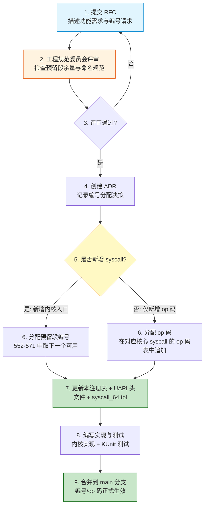

Copyright (c) 2025-2026 SPHARX Ltd. All Rights Reserved.

# Agent 系统调用编号注册表（SSoT）
> **文档定位**：agentrt-linux（AirymaxOS）专用系统调用编号的唯一权威注册表（Single Source of Truth），统一编号分配、命名前缀、ABI 稳定性约束、UAPI 头文件模板与注册审批流程\
> **文档版本**：v1.0.1\
> **最后更新**： 2026-07-22\
> **上级文档**：[agentrt-linux 设计文档](README.md)\
> **同源映射**：Linux 6.6 `include/uapi/asm-generic/unistd.h`（编号注册表）+ seL4 `libsel4/include/api/syscall.xml`（接口契约代码生成）\
> **文档性质**：实现方案文档（非设计文档）。本注册表不替代 [30-interfaces/01-syscalls.md](../30-interfaces/01-syscalls.md) 的接口设计与 [50-engineering-standards/20-contracts/contracts.md](../50-engineering-standards/20-contracts/contracts.md) 的契约定义，仅作为编号分配的唯一权威来源（SSoT）对所有设计文档与契约文档的编号进行统一收口\
> **设计参考**：主流 Linux 发行版 Linux 6.6 内核基线 `arch/x86/entry/syscalls/syscall_64.tbl`（编号表格式）+ seL4 `syscall.xml` + `syscall_generator.py`（声明式接口定义）

---

## 1. SSoT 声明

### 1.1 唯一权威来源

本注册表是 agentrt-linux 专用系统调用编号的**唯一权威来源**（Single Source of Truth）。所有涉及系统调用编号的文档、头文件、实现代码、测试用例必须以本注册表为准。

| 文档类型 | 文档路径 | 与本注册表的关系 |
|---------|---------|----------------|
| 接口设计文档 | [30-interfaces/01-syscalls.md](../30-interfaces/01-syscalls.md) | 设计意图来源，其编号定义以本注册表为准 |
| API 契约文档 | [50-engineering-standards/20-contracts/contracts.md](../50-engineering-standards/20-contracts/contracts.md) | 契约定义来源，其编号段以本注册表为准 |
| Agent 生命周期 | [01-agent-lifecycle.md](01-agent-lifecycle.md) | 应用层 API（`airy_agent_*`）通过 op-dispatch 映射到本注册表的 4 核心 syscall |
| UAPI 头文件 | `kernel/include/uapi/agentrt/syscalls.h` | 由本注册表派生（1.0.1 阶段可由代码生成器自动生成） |
| 内核入口表 | `kernel/arch/x86/entry/syscalls/syscall_64.tbl` | 由本注册表派生 |

### 1.2 冲突解决规则

当任何文档与本注册表发生编号冲突时，以本注册表为准，并按第 11 章「已知不一致问题与修复指引」执行修复。

### 1.3 SSoT 演进原则

本注册表遵循 IRON-9 v3 同源且部分代码共享原则的 [SC] 层要求：编号定义在 agentrt（用户态）与 agentrt-linux（OS 层）之间共享，两端必须引用同一编号注册表，禁止任何一端独立修改编号。

### 1.4 v1.0.1 Capability Folding 架构约束

v1.0.1 采用 **Capability Folding 单平面架构**（详见 [01-syscalls.md](../30-interfaces/01-syscalls.md) §1）：控制面仅保留 4 个低频管理 syscall，IPC 数据传递与能力校验全部折叠到 io_uring 数据面 fastpath（C-S9 内联 Badge 校验）。0.1.1 阶段的 31 个独立 syscall（6 类 × 20 编号段）已被 4 核心 syscall + op-dispatch 模型取代。0.1.1 模型保留在 [附录 A](#附录-a-011-历史-syscall-模型已废弃) 作为历史参考，不再作为编号分配依据。

---

## 2. 编号分配规则

### 2.1 编号空间划分

agentrt-linux 专用系统调用编号从 `548` 起始分配，避开 Linux 6.6 标准 0-511 编号空间与 x86_64 x32 历史遗留区域（512-547）。

> **v1.0.1 编号起点修正**：0.1.1 阶段原设计使用 512 起始，但 x86_64 架构的 512-547 是 x32 历史遗留区域（`syscall_64.tbl` L384-388 明确标注 "Do not add new syscalls to this range. Numbers 548 and above are available for non-x32 use"）。v1.0.1 修正为 548 起始，确保在 x86_64/arm64/riscv 所有架构上编号一致，实现跨架构二进制兼容。

| 编号范围 | 用途 | 管理方 |
|---------|------|--------|
| 0-511 | Linux 6.6 标准系统调用 | Linux 上游（不可修改） |
| 512-547 | x86_64 x32 历史遗留区域（禁止使用） | Linux 上游（不可修改） |
| 548-571 | agentrt-linux 专用系统调用（4 核心 + 20 预留 = 24 槽位） | 本注册表 |
| 572-1023 | 预留扩展空间 | 本注册表（需 ADR 审批） |
| 1024+ | 未来 MAJOR 版本扩展 | 需新 ADR + ABI 审查 |

### 2.2 槽位分配（v1.0.1：4 核心 + 20 预留 = 24 槽位）

v1.0.1 Capability Folding 架构下，控制面精简为 4 核心 syscall，其余操作通过 op-dispatch 或 io_uring 数据面承载：

| 编号 | 符号 | 分类 | 说明 | op-dispatch |
|------|------|------|------|-------------|
| 548 | `AIRY_SYS_CALL` | Capability Invocation | sec_d 专属管理入口 | COMPILE_BADGE / REVOKE_BADGE / LSM_CTL / WASM_LOAD |
| 549 | `AIRY_SYS_ROVOL_CTL` | 控制原语 | MemoryRovol L1-L4 控制 | SNAPSHOT / RESTORE / MIGRATE / TIER_SET / TIER_GET / MGLRU_CONFIG / LIST / DELETE / DEMOTE / PROMOTE |
| 550 | `AIRY_SYS_SCHED_CTL` | 控制原语 | sched_tac 调度策略配置 | SET_POLICY / GET_POLICY / SET_BUDGET / GET_LATENCY / SET_PRIORITY / GET_VTIME / YIELD |
| 551 | `AIRY_SYS_CLT_NOTIFY` | 控制原语 | CoreLoopThree 阶段通知 + kthread | PHASE_NOTIFY / REGISTER_KTHREAD / UNREGISTER_KTHREAD / SET_MODE / GET_METRICS / WASM_LOAD_MODULE / WASM_UNLOAD_MODULE / WASM_INVOKE |
| 552-571 | 预留 | — | 未来扩展 | — |

**设计决策理由**：v1.0.1 Capability Folding 将 0.1.1 的 31 个独立 syscall 精简为 4 核心 syscall + op-dispatch。IPC 数据传递完全由 io_uring `IORING_OP_URING_CMD` 承载（零 syscall）；Agent 生命周期管理由 sec_d 通过 `airy_sys_call(COMPILE_BADGE/REVOKE_BADGE)` + io_uring 组合实现。此设计消除了 0.1.1 的控制面/数据面双平面死锁风险（详见 [01-syscalls.md](../30-interfaces/01-syscalls.md) §1.3）。

### 2.3 编号不变性规则（ABI 铁律）

编号一旦分配，遵循以下四条不变性规则，对齐 OS-IRON-001（用户空间 ABI 永不破坏）：

1. **编号不可变更**：编号在 MAJOR 版本内不可变更。即使系统调用被废弃，编号保留，返回 `-AIRY_ENOSYS`。
2. **编号不可复用**：废弃编号永不复用。新系统调用只能追加到预留段末尾。
3. **语义不可破坏**：已分配编号的语义（参数个数、参数类型、返回值含义）在 MAJOR 版本内不可破坏性变更。可向后兼容地扩展（如结构体新增字段通过 `version` 字段协商）。op-dispatch 的操作码（opcode）同样遵循此规则——已分配的 opcode 不可变更、不可复用。
4. **编号段扩展需 ADR**：若 24 槽位（548-571）耗尽，需在下一 MAJOR 版本中扩展编号段，并创建架构决策记录（ADR）记录扩展理由与影响。

### 2.4 命名前缀规范

所有 agentrt-linux 专用系统调用统一使用以下命名前缀，遵循五维正交 24 原则中的 E-5（命名语义化）：

| 前缀（宏形式） | C 符号形式 | 编号 | 分类 | 说明 |
|---------------|-----------|------|------|------|
| `AIRY_SYS_CALL` | `airy_sys_call` | 548 | Capability Invocation | sec_d 专属管理入口（cap-type dispatch） |
| `AIRY_SYS_ROVOL_CTL` | `airy_sys_rovol_ctl` | 549 | 控制原语 | MemoryRovol 记忆卷载控制（op dispatch） |
| `AIRY_SYS_SCHED_CTL` | `airy_sys_sched_ctl` | 550 | 控制原语 | sched_tac 调度策略配置（op dispatch） |
| `AIRY_SYS_CLT_NOTIFY` | `airy_sys_clt_notify` | 551 | 控制原语 | CoreLoopThree 阶段通知 + kthread（op dispatch） |

**命名结构**：`airy_sys_<category>_<action>`

- `airy_sys_` = agentrt-linux 系统调用前缀
- `<category>` = `call` / `rovol_ctl` / `sched_ctl` / `clt_notify`
- `<action>` = 由 op 参数分派（op-dispatch），不再编入 syscall 名称

> **v1.0.1 命名变更说明**：0.1.1 阶段使用 6 类前缀（`AIRY_SYS_TASK_*` / `IPC_*` / `ROVOL_*` / `SCHED_*` / `CAP_*` / `CLT_*`），每类对应独立 syscall。v1.0.1 Capability Folding 后，6 类操作折叠到 4 核心 syscall 的 op-dispatch 中，前缀精简为 4 个。0.1.1 的 6 类前缀保留在 [附录 A](#附录-a-011-历史-syscall-模型已废弃) 供历史参考。

---

## 3. 完整编号注册表

### 3.1 控制面 syscall（548-551，4 核心）

| 编号 | 宏定义 | C 符号 | 功能 | 参数数 | 引入版本 | 状态 |
|------|--------|--------|------|--------|---------|------|
| 548 | `AIRY_SYS_CALL` | `airy_sys_call` | Capability Invocation（sec_d 专属管理：COMPILE_BADGE / REVOKE_BADGE / LSM_CTL / WASM_LOAD） | 2 | 0.1.1（v1.0.1 语义收窄） | 已分配 |
| 549 | `AIRY_SYS_ROVOL_CTL` | `airy_sys_rovol_ctl` | MemoryRovol 记忆卷载控制（op-dispatch：SNAPSHOT / RESTORE / MIGRATE / TIER_SET / TIER_GET / MGLRU_CONFIG / LIST / DELETE / DEMOTE / PROMOTE） | 3 | 0.1.1 | 已分配 |
| 550 | `AIRY_SYS_SCHED_CTL` | `airy_sys_sched_ctl` | sched_tac 调度策略配置（op-dispatch：SET_POLICY / GET_POLICY / SET_BUDGET / GET_LATENCY / SET_PRIORITY / GET_VTIME / YIELD） | 3 | 0.1.1 | 已分配 |
| 551 | `AIRY_SYS_CLT_NOTIFY` | `airy_sys_clt_notify` | CoreLoopThree 阶段通知 + kthread（op-dispatch：PHASE_NOTIFY / REGISTER_KTHREAD / UNREGISTER_KTHREAD / SET_MODE / GET_METRICS / WASM_LOAD_MODULE / WASM_UNLOAD_MODULE / WASM_INVOKE） | 2 | 0.1.1 | 已分配 |

**参数数说明**：指系统调用本身的参数数量（不含系统调用编号）。超过 6 个参数时使用结构体指针封装（遵循 Linux x86_64 System V AMD64 ABI 约束，详见 [contracts.md](../50-engineering-standards/20-contracts/contracts.md) 第 3 章）。

### 3.2 预留段（552-571）

| 编号 | 宏定义 | 状态 | 说明 |
|------|--------|------|------|
| 552-571 | `AIRY_SYS_RESERVED_0` ~ `AIRY_SYS_RESERVED_19` | 预留 | 未来扩展。新增 syscall 需按 [§7 审批流程](#7-编号注册审批流程) 执行 |

### 3.3 数据面（io_uring，零 syscall）

IPC 数据传递完全由 io_uring `IORING_OP_URING_CMD` + `cmd_op` 区分操作承载，不占用 syscall 编号：

| cmd_op | 操作 | 说明 |
|--------|------|------|
| `AIRY_URING_CMD_IPC_SEND` | IPC 发送 | 替代 0.1.1 的 `airy_sys_ipc_send` |
| `AIRY_URING_CMD_IPC_RECV` | IPC 接收 | 接收方 poll CQE（无需 syscall） |
| `AIRY_URING_CMD_IPC_SEND_BATCH` | IPC 批量发送 | 替代 0.1.1 的 `airy_sys_call_batch` |
| `AIRY_URING_CMD_IPC_CANCEL` | IPC 取消 | 取消待完成 SQE |
| `AIRY_URING_CMD_IPC_FREEZE` | IPC 冻结 | 安全冻结端点 |
| `AIRY_URING_CMD_IPC_CAP_REQUEST` | Capability 请求 | 替代 0.1.1 的 `airy_sys_capability_request` |
| `AIRY_URING_CMD_IPC_CAP_RESPONSE` | Capability 响应 | sec_d 编译 Badge 后返回 |

详见 [02-ipc-protocol.md §4.4](../30-interfaces/02-ipc-protocol.md)。

---

## 4. op-dispatch 操作映射表

### 4.1 设计原则

v1.0.1 的 4 核心 syscall 通过 **op-dispatch**（操作码分派）承载 0.1.1 阶段的 31 个独立 syscall 的全部功能。每个核心 syscall 的第一个参数为 `op`（操作码），内核根据 `op` 值分派到具体处理函数。此设计是 Capability Folding 的直接结果——控制面 syscall 仅提供机制入口，具体操作由 op 码区分。

### 4.2 airy_sys_call op-dispatch（Capability Invocation）

`airy_sys_call(cap_t cap, const struct airy_ipc_msg_hdr *msg)` 通过 `msg->opcode` 分派：

| op 码 | 操作名 | 功能 | 0.1.1 对应 syscall | 说明 |
|-------|--------|------|-------------------|------|
| `AIRY_OP_COMPILE_BADGE` | Badge 编译 | sec_d 编译 Capability Badge（Epoch + Random Tag + Perms） | `airy_sys_delegate` / `airy_sys_mint` | 集中到 sec_d，消除分散 mint/derive |
| `AIRY_OP_REVOKE_BADGE` | Badge 撤销 | sec_d 撤销 Badge（1 行 atomic_inc 立即生效） | `airy_sys_revoke` / `airy_sys_capability_revoke` | 全局 Epoch 自增，所有旧 Badge 失效 |
| `AIRY_OP_LSM_CTL` | LSM 策略加载 | 加载 airy_lsm 策略 | `airy_sys_lsm_load_policy` / `airy_sys_lsm_ctl` | 合并 0.1.1 的两个 LSM syscall |
| `AIRY_OP_WASM_LOAD` | Wasm 模块加载 | 加载 Wasm 3.0 安全模块 | `airy_sys_wasm_load_module` | cap-type dispatch |
| `AIRY_OP_LSM_AUDIT_QUERY` | 审计查询 | 查询 airy_lsm 审计日志 | `airy_sys_lsm_audit_query` | 0.1.1 独立 syscall → v1.0.1 合入 |
| `AIRY_OP_CAP_INSPECT` | Capability 检查 | 检查 capability 权限 | `airy_sys_capability_inspect` | 0.1.1 独立 syscall → v1.0.1 合入 |
| `AIRY_OP_CAP_TRANSFER` | Capability 传递 | 通过 IPC 传递 capability | `airy_sys_capability_transfer` | 0.1.1 独立 syscall → v1.0.1 合入 |

### 4.3 airy_sys_rovol_ctl op-dispatch（MemoryRovol 控制）

`airy_sys_rovol_ctl(uint32_t op, uint32_t pid, uint64_t arg)` 通过 `op` 分派：

| op 码 | 操作名 | 功能 | 0.1.1 对应 syscall |
|-------|--------|------|-------------------|
| `AIRY_ROVOL_SNAPSHOT` | 创建快照 | 创建进程记忆快照 | `airy_sys_rovol_snapshot`（0.1.1 编号 552） |
| `AIRY_ROVOL_RESTORE` | 恢复快照 | 从快照恢复记忆 | `airy_sys_rovol_restore`（0.1.1 编号 553） |
| `AIRY_ROVOL_MIGRATE` | 跨节点迁移 | 跨超节点记忆迁移 | `airy_sys_rovol_migrate`（0.1.1 编号 554） |
| `AIRY_ROVOL_TIER_SET` | 设置分层策略 | CXL 内存分层策略 | `airy_sys_cxl_tier_set`（0.1.1 编号 555） |
| `AIRY_ROVOL_MGLRU_CONFIG` | MGLRU 配置 | 多代 LRU 配置 | `airy_sys_mglru_config`（0.1.1 编号 556） |
| `AIRY_ROVOL_LIST` | 列出快照 | 列出进程所有快照 | `airy_sys_rovol_list`（0.1.1 编号 557） |
| `AIRY_ROVOL_DELETE` | 删除快照 | 删除指定快照 | `airy_sys_rovol_delete`（0.1.1 编号 558） |
| `AIRY_ROVOL_DEMOTE` | 层级降级 | L1→L2→L3→L4 降级 | `airy_sys_rovol_demote`（0.1.1 编号 559） |
| `AIRY_ROVOL_PROMOTE` | 层级晋升 | L4→L3→L2→L1 晋升 | `airy_sys_rovol_promote`（0.1.1 编号 560） |
| `AIRY_ROVOL_TIER_GET` | 查询分层策略 | 查询 CXL 分层策略 | `airy_sys_cxl_tier_get`（0.1.1 编号 561） |

### 4.4 airy_sys_sched_ctl op-dispatch（调度控制）

`airy_sys_sched_ctl(uint32_t op, uint32_t agent_id, uint64_t arg)` 通过 `op` 分派：

| op 码 | 操作名 | 功能 | 0.1.1 对应 syscall |
|-------|--------|------|-------------------|
| `AIRY_SCHED_SET_POLICY` | 设置调度策略 | 设置 sched_tac 调度策略 | `airy_sys_sched_set_policy`（0.1.1 编号 572） |
| `AIRY_SCHED_GET_POLICY` | 查询调度策略 | 查询当前调度策略 | `airy_sys_sched_get_policy`（0.1.1 编号 573） |
| `AIRY_SCHED_SET_BUDGET` | 注入调度预算参数 | sched_d 通过 `sched_setattr()` 注入 sched_runtime/deadline/period（SCHED_DEADLINE 语义，H5 纯 C 无 BPF 依赖） | `airy_sys_sched_set_budget`（0.1.1 编号 574） |
| `AIRY_SCHED_GET_LATENCY` | 查询调度延迟 | 查询调度延迟统计 | `airy_sys_sched_get_latency`（0.1.1 编号 575） |
| `AIRY_SCHED_SET_PRIORITY` | 设置优先级 | 设置 Agent 优先级（0-139） | `airy_sys_sched_set_priority`（0.1.1 编号 576） |
| `AIRY_SCHED_GET_VTIME` | 查询虚拟时间 | 查询 Agent 虚拟时间 | `airy_sys_sched_get_vtime`（0.1.1 编号 577） |
| `AIRY_SCHED_YIELD` | 主动让出 | Agent 主动让出 CPU | `airy_sys_sched_yield`（0.1.1 编号 578） |

### 4.5 airy_sys_clt_notify op-dispatch（认知循环控制）

`airy_sys_clt_notify(int task_id, uint32_t op)` 通过 `op` 分派：

| op 码 | 操作名 | 功能 | 0.1.1 对应 syscall |
|-------|--------|------|-------------------|
| `AIRY_CLT_PHASE_NOTIFY` | 阶段通知 | CoreLoopThree 阶段通知 | `airy_sys_clt_phase_notify`（0.1.1 编号 612） |
| `AIRY_CLT_REGISTER_KTHREAD` | 注册 kthread | 注册 CoreLoopThree kthread | `airy_sys_clt_register_kthread`（0.1.1 编号 613） |
| `AIRY_CLT_UNREGISTER_KTHREAD` | 注销 kthread | 注销 CoreLoopThree kthread | `airy_sys_clt_unregister_kthread`（0.1.1 编号 615） |
| `AIRY_CLT_SET_MODE` | 设置模式 | 设置 Thinkdual 模式（System1/System2） | `airy_sys_clt_set_mode`（0.1.1 编号 616） |
| `AIRY_CLT_GET_METRICS` | 查询指标 | 查询 Token 能效指标 | `airy_sys_clt_get_metrics`（0.1.1 编号 617） |
| `AIRY_CLT_WASM_UNLOAD_MODULE` | 卸载 Wasm | 卸载 Wasm 模块 | `airy_sys_wasm_unload_module`（0.1.1 编号 618） |
| `AIRY_CLT_WASM_INVOKE` | 调用 Wasm | 调用 Wasm 函数 | `airy_sys_wasm_invoke`（0.1.1 编号 619） |

> **Wasm 模块加载**：`WASM_LOAD_MODULE`（0.1.1 编号 614）在 v1.0.1 中通过 `airy_sys_call(AIRY_OP_WASM_LOAD)` 实现，因为 Wasm 模块加载属于 sec_d 的 capability invocation 职责。

---

## 5. Agent 生命周期 API 与 op-dispatch 映射

### 5.1 映射必要性

[01-agent-lifecycle.md](01-agent-lifecycle.md) 定义了 Agent 生命周期应用层 API，使用 `airy_agent_*` 前缀（如 `airy_agent_register()`）。这些是 SDK 层封装的便捷 API，底层通过 4 核心 syscall + io_uring 组合实现。本节建立应用层 API 到内核机制的映射关系。

### 5.2 完整映射表

| 应用层 API（SDK 封装） | 内核机制 | 生命周期状态转换 |
|----------------------|---------|----------------|
| `airy_agent_register()` | `airy_sys_call(AIRY_OP_COMPILE_BADGE)` + io_uring ring 注册 | → REGISTERED |
| `airy_agent_configure()` | `airy_sys_sched_ctl(AIRY_SCHED_SET_POLICY)` + `airy_sys_rovol_ctl(AIRY_ROVOL_MGLRU_CONFIG)` | REGISTERED → CONFIGURED |
| `airy_agent_start()` | io_uring `IORING_OP_URING_CMD`（激活 Agent ring） | CONFIGURED → RUNNING |
| `airy_agent_pause()` | `airy_sys_sched_ctl(AIRY_SCHED_SET_PRIORITY, prio=0)` | RUNNING → PAUSING → PAUSED |
| `airy_agent_resume()` | `airy_sys_sched_ctl(AIRY_SCHED_SET_PRIORITY, prio>0)` | PAUSED/SUSPENDED → RUNNING |
| `airy_agent_stop()` | `airy_sys_call(AIRY_OP_REVOKE_BADGE)` + io_uring ring 注销 | RUNNING → TERMINATING → TERMINATED |
| `airy_agent_migrate()` | `airy_sys_rovol_ctl(AIRY_ROVOL_MIGRATE)` + io_uring ring 迁移 | PAUSED → 迁移 → 目标节点 RUNNING |
| `airy_agent_get_state()` | io_uring `IORING_OP_URING_CMD`（查询 CQE 状态） | 查询当前状态 |
| `airy_agent_set_token_budget()` | `airy_sys_clt_notify(AIRY_CLT_SET_MODE)`（Token 预算模式） | 设置 Token 预算 |
| `airy_agent_get_token_budget()` | `airy_sys_clt_notify(AIRY_CLT_GET_METRICS)` | 查询 Token 预算 |
| `airy_cap_revoke()` | `airy_sys_call(AIRY_OP_REVOKE_BADGE)` | 终止时递归撤销 capability |

**映射设计决策理由**：
1. **前缀分离**：`airy_agent_*` 是 SDK 应用层 API（用户友好），4 核心 syscall 是内核系统调用（机制层）。分离前缀遵循 K-1（机制在内核，策略在用户态）——SDK 层封装策略（重试、错误转换、日志），系统调用层仅提供机制。
2. **无独立 TASK syscall**：v1.0.1 Capability Folding 后，Agent 生命周期操作不再有独立内核 syscall，而是通过 4 核心 syscall + io_uring 组合实现。0.1.1 的 `AIRY_SYS_TASK_*`（编号 512-524）已废弃（见 [附录 A](#附录-a-011-历史-syscall-模型已废弃)）。
3. **migrate 复用 ROVOL**：`airy_agent_migrate()` 复用 `airy_sys_rovol_ctl(AIRY_ROVOL_MIGRATE)`，因为 Agent 迁移本质是记忆卷载迁移 + ring 迁移。

### 5.3 SDK 封装示例

```c
/* agentrt SDK 层封装示例（libagentrt/agent_lifecycle.c） */

/**
 * airy_agent_register - 注册一个新的 Agent（SDK 便捷 API）
 * @config: Agent 注册配置
 * @agent_id: 输出参数，返回分配的 Agent ID
 *
 * 返回: 0 成功，<0 AIRY_E* 错误码
 *
 * 本函数是 airy_sys_call(AIRY_OP_COMPILE_BADGE)（编号 548）的 SDK 封装，
 * 增加参数校验、错误日志、重试逻辑。
 */
int airy_agent_register(const struct airy_agent_config *config,
                           uint32_t *agent_id)
{
    struct airy_ipc_msg_hdr msg = {};
    int ret;

    /* 1. 参数校验（SDK 层策略） */
    if (!config || !agent_id)
        return -AIRY_EINVAL;
    if (config->name[0] == '\0')
        return -AIRY_EINVAL;

    /* 2. 构造 Badge 编译请求消息 */
    msg.magic   = AIRY_IPC_MAGIC;
    msg.opcode  = AIRY_OP_COMPILE_BADGE;
    msg.dst_task = 0;  /* sec_d */

    /* 3. 调用系统调用（机制层） */
    ret = airy_sys_call(sec_d_cap, &msg);
    if (ret < 0) {
        log_write(LOG_ERROR, "agent_register failed: errno=%d (%s)",
                  ret, airy_strerror(ret));
        return ret;
    }
    *agent_id = msg.capability_badge & 0xFFFFFFFF;

    /* 4. 审计日志（SDK 层策略） */
    log_write(LOG_INFO, "agent registered: id=%u name=%s", *agent_id, config->name);
    return AIRY_EOK;
}
```

---

## 6. UAPI 头文件定义模板

### 6.1 头文件位置

系统调用 UAPI 头文件位于 `kernel/include/uapi/agentrt/syscalls.h`，由本注册表派生。1.0.1 阶段可通过代码生成器从本注册表自动生成（R-01 增强，借鉴 seL4 `syscall.xml` + `syscall_generator.py`）。

### 6.2 完整 UAPI 头文件模板

```c
/* SPDX-License-Identifier: GPL-2.0 WITH Linux-syscall-note */
/*
 * Copyright (c) 2025-2026 SPHARX Ltd. All Rights Reserved.
 *
 * agentrt-linux (AirymaxOS) Agent 专用系统调用编号定义
 *
 * 本文件由 140-application-development/07-syscall-registry.md 派生。
 * 编号注册表 SSoT: docs/AirymaxOS/140-application-development/07-syscall-registry.md
 *
 * 编号规则:
 *   - 起始编号 548（避开 Linux 6.6 标准 0-511 + x86_64 x32 区域 512-547）
 *   - 4 核心 syscall + 20 预留 = 24 槽位（v1.0.1 Capability Folding）
 *   - 编号在 MAJOR 版本内不可变更（OS-IRON-001）
 *   - 废弃编号保留，返回 -AIRY_ENOSYS
 */

#ifndef _UAPI_AIRY_SYSCALLS_H
#define _UAPI_AIRY_SYSCALLS_H

#include <linux/types.h>

#ifdef __cplusplus
extern "C" {
#endif

/* ====================================================================
 * v1.0.1 Capability Folding：4 核心 syscall + 20 预留 = 24 槽位
 * 编号范围 548-571
 * ==================================================================== */

#define AIRY_SYS_BASE            548  /* agentrt-linux 专用编号起始 */

/* 4 核心 syscall（548-551） */
#define AIRY_SYS_CALL            548  /* Capability Invocation（sec_d 专属管理） */
#define AIRY_SYS_ROVOL_CTL       549  /* MemoryRovol 记忆卷载控制 */
#define AIRY_SYS_SCHED_CTL       550  /* sched_tac 调度策略配置 */
#define AIRY_SYS_CLT_NOTIFY      551  /* CoreLoopThree 阶段通知 + kthread */

/* 20 预留槽位（552-571） */
#define AIRY_SYS_RESERVED_0      552
#define AIRY_SYS_RESERVED_1      553
/* ... */
#define AIRY_SYS_RESERVED_19     571

#define AIRY_SYS_NR_CORE         4    /* 核心 syscall 数 */
#define AIRY_SYS_NR_RESERVED     20   /* 预留槽位数 */
#define AIRY_SYS_NR_TOTAL        24   /* 总槽位数（548-571） */

/* ====================================================================
 * op-dispatch 操作码（由各核心 syscall 的 op 参数携带）
 * opcode 在 MAJOR 版本内不可变更（OS-IRON-001）
 * ==================================================================== */

/* airy_sys_call op 码（通过 msg->opcode 传递） */
#define AIRY_OP_COMPILE_BADGE    0x01
#define AIRY_OP_REVOKE_BADGE     0x02
#define AIRY_OP_LSM_CTL          0x03
#define AIRY_OP_WASM_LOAD        0x04
#define AIRY_OP_LSM_AUDIT_QUERY  0x05
#define AIRY_OP_CAP_INSPECT      0x06
#define AIRY_OP_CAP_TRANSFER     0x07

/* airy_sys_rovol_ctl op 码 */
#define AIRY_ROVOL_SNAPSHOT      0x01
#define AIRY_ROVOL_RESTORE       0x02
#define AIRY_ROVOL_MIGRATE       0x03
#define AIRY_ROVOL_TIER_SET      0x04
#define AIRY_ROVOL_MGLRU_CONFIG  0x05
#define AIRY_ROVOL_LIST          0x06
#define AIRY_ROVOL_DELETE        0x07
#define AIRY_ROVOL_DEMOTE        0x08
#define AIRY_ROVOL_PROMOTE       0x09
#define AIRY_ROVOL_TIER_GET      0x0A

/* airy_sys_sched_ctl op 码 */
#define AIRY_SCHED_SET_POLICY    0x01
#define AIRY_SCHED_GET_POLICY    0x02
#define AIRY_SCHED_SET_BUDGET    0x03
#define AIRY_SCHED_GET_LATENCY   0x04
#define AIRY_SCHED_SET_PRIORITY  0x05
#define AIRY_SCHED_GET_VTIME     0x06
#define AIRY_SCHED_YIELD         0x07

/* airy_sys_clt_notify op 码 */
#define AIRY_CLT_PHASE_NOTIFY         0x01
#define AIRY_CLT_REGISTER_KTHREAD     0x02
#define AIRY_CLT_UNREGISTER_KTHREAD   0x03
#define AIRY_CLT_SET_MODE             0x04
#define AIRY_CLT_GET_METRICS          0x05
#define AIRY_CLT_WASM_UNLOAD_MODULE   0x06
#define AIRY_CLT_WASM_INVOKE          0x07

#ifdef __cplusplus
}
#endif

#endif /* _UAPI_AIRY_SYSCALLS_H */
```

### 6.3 内核入口表模板（syscall_64.tbl 格式）

参考主流 Linux 发行版 Linux 6.6 内核基线 `arch/x86/entry/syscalls/syscall_64.tbl` 格式：

```
# <number> <abi> <name>                  <entry point>
# agentrt-linux 专用系统调用（548-571，v1.0.1 Capability Folding）
548     common  airy_sys_call            sys_airy_sys_call
549     common  airy_sys_rovol_ctl       sys_airy_sys_rovol_ctl
550     common  airy_sys_sched_ctl       sys_airy_sys_sched_ctl
551     common  airy_sys_clt_notify      sys_airy_sys_clt_notify
# 552-571 预留
```

---

## 7. 编号注册审批流程

### 7.1 新增系统调用注册流程

新增系统调用必须遵循以下审批流程，确保编号分配的可追溯性与 ABI 稳定性：



### 7.2 审批检查清单

新增系统调用或 op 码注册时，工程规范委员会必须检查以下项：

| # | 检查项 | 通过标准 |
|---|--------|---------|
| 1 | 预留段/op 码余量 | 预留段至少有 1 个编号可用，或对应核心 syscall 的 op 码表有空间 |
| 2 | 命名规范 | syscall 符合 `airy_sys_*` 前缀；op 码符合 `AIRY_<CATEGORY>_*` 前缀 |
| 3 | 参数数限制 | ≤ 6 个参数（超过用结构体封装） |
| 4 | 错误码定义 | 使用 `AIRY_E*` 错误码，不引入新前缀 |
| 5 | capability 守卫 | 安全敏感调用/op 标注是否需要 capability 令牌 |
| 6 | 性能基准 | 附带延迟预算与测量方法 |
| 7 | 测试用例 | 附带 KUnit 或 kselftest 测试用例 |
| 8 | 文档更新 | 更新本注册表 + UAPI 头文件 +（如新增 syscall）内核入口表 |
| 9 | 同源对齐 | 确认与 agentrt 用户态同源语义一致（若适用） |

### 7.3 废弃流程

废弃系统调用或 op 码遵循以下流程：

1. **标记废弃**：在本注册表中标注 `@deprecated since <version>`，并提供迁移指引。
2. **保留编号/op 码**：废弃编号永不复用，内核实现改为返回 `-AIRY_ENOSYS`；废弃 op 码永不复用，内核返回 `-AIRY_EINVAL`。
3. **宽限期**：废弃后保留至少 1 个 MAJOR 版本的宽限期，期间继续可用（但标记废弃警告）。
4. **最终移除**：宽限期结束后，内核返回 `-AIRY_ENOSYS`（syscall）或 `-AIRY_EINVAL`（op 码），但编号/op 码永不复用。

---

## 8. ABI 稳定性约束

### 8.1 四层稳定性分级

agentrt-linux 系统调用遵循四层稳定性分级，对齐 [160-compatibility/01-abi-stability.md](../160-compatibility/01-abi-stability.md)：

| 层级 | 接口类型 | 稳定性 | 变更流程 |
|------|---------|--------|---------|
| L1 | 系统调用编号 + 语义 | 永不破坏（OS-IRON-001） | RFC + ABI 审查 + 6 个月宽限期 |
| L2 | op-dispatch 操作码 + 语义 | 永不破坏（OS-IRON-001） | RFC + ABI 审查 |
| L3 | 系统调用参数结构体 | 语义版本化 | 结构体 `version` 字段协商 |
| L4 | 错误码值 | MAJOR 版本内不可变更 | 新增错误码只能追加到末尾 |
| L5 | 内部实现 | 完全自由 | 无约束 |

### 8.2 结构体版本协商

参数结构体通过 `version` 字段实现向后兼容扩展：

```c
/**
 * airy_task_config - Agent 注册配置结构体（版本化）
 *
 * @size:    结构体大小（用于版本协商，必须为首字段）
 * @version:  结构体版本（当前 0x0100 = 1.0）
 * @reserved: 保留字段（必须填充为 0，未来扩展）
 *
 * 版本协商规则:
 *   - 内核检查 size 字段，若大于已知大小，仅读取已知部分
 *   - 内核检查 version 字段，若版本不匹配，返回 -AIRY_ENOTSUP
 *   - 新增字段只能追加到结构体末尾，不可修改已有字段顺序
 */
struct airy_task_config {
    uint32_t size;              /* 结构体大小（版本协商） */
    uint32_t version;           /* 结构体版本（当前 0x0100） */
    uint32_t reserved;           /* 保留字段（填充为 0） */

    /* 1.0 字段 */
    char     name[64];          /* Agent 名称 */
    uint32_t type;              /* Agent 类型（AGENT_TYPE_*） */
    uint32_t initial_token_budget;
    uint32_t memory_rovol_layers;
    uint64_t capability_flags;
} __attribute__((aligned(8)));
```

### 8.3 错误码稳定性

错误码值在 MAJOR 版本内不可变更，新增错误码只能追加到末尾。完整错误码注册表见 [30-interfaces/01-syscalls.md](../30-interfaces/01-syscalls.md) 第 6 章与 [contracts.md](../50-engineering-standards/20-contracts/contracts.md) 第 4 章。

---

## 9. 性能约束引用

系统调用性能约束对齐 NFR-P-001（详见 [00-requirements/03-non-functional-requirements.md](../00-requirements/03-non-functional-requirements.md)）：

| 约束 ID | 指标 | 阈值（P99） | 测量方法 |
|---------|------|------------|---------|
| NFR-P-001 | Agent 任务调度延迟 | < 100 ms | `airy_sys_call(COMPILE_BADGE)` 到任务首次执行 |
| NFR-P-001a | 系统调用本身开销 | < 1 μs | strace + perf 测量 |
| NFR-P-001b | io_uring IPC 往返延迟 | < 10 μs | `IORING_OP_URING_CMD` SEND + RECV 往返 |

### 9.1 各核心 syscall 延迟预算

| 核心 syscall | 典型延迟（P99） | 最大延迟（P99.9） | 测量命令 |
|-------------|---------------|------------------|---------|
| `airy_sys_call` | < 1 μs | < 5 μs | `perf trace -e airy_sys_call` |
| `airy_sys_rovol_ctl` | < 5 μs（快照）/ < 100 ms（迁移） | < 10 μs / < 500 ms | `perf trace -e airy_sys_rovol_ctl` |
| `airy_sys_sched_ctl` | < 1 μs | < 5 μs | `perf trace -e airy_sys_sched_ctl` |
| `airy_sys_clt_notify` | < 1 μs | < 5 μs | `perf trace -e airy_sys_clt_notify` |

### 9.2 性能回归保护

- 每次 PR 运行 `tests-linux/benchmark/syscall-latency` 微基准。
- 与基线对比，延迟退化 > 5% 自动打回。
- 新增 op 码必须附带性能基准测试。

---

## 10. IRON-9 v3 同源映射

### 10.1 [SC] 层共享（10 个头文件）

agentrt-linux 与 agentrt 在以下 10 个头文件中实现代码字面共享，影响系统调用语义：

| 头文件 | 共享内容 | 影响的核心 syscall |
|--------|---------|------------------|
| `syscalls.h` | v1.0.1: 4 核心 syscall 编号 + 20 预留槽位 + op 码定义 | 系统调用（SYS） |
| `memory_types.h` | MemoryRovol L1-L4 数据结构 + GFP 掩码 | `airy_sys_rovol_ctl` |
| `security_types.h` | capability 41 ID 枚举 + LSM 250 钩子 + 派生模型 + Badge 位布局 | `airy_sys_call` |
| `cognition_types.h` | CoreLoopThree 阶段枚举 + Thinkdual 模式 | `airy_sys_clt_notify` |
| `sched.h` | 任务描述符（magic 0x41475453）+ vtime 衰减 | `airy_sys_sched_ctl` |
| `ipc.h` | IPC magic（0x41524531）+ 128B 消息头 + capability_badge 字段 | `airy_sys_call`（管理 opcode 通过 msg.opcode 传递） |

### 10.2 [SS] 层语义同源

| 核心 syscall | agentrt 用户态 | agentrt-linux OS 层 | 同源语义 |
|-------------|---------------|-------------------|---------|
| `airy_sys_call` | Cupolas 应用权限模型（用户态 Badge=0，H3） | sec_d 编译/撤销 Badge（H4） | Capability Invocation 语义一致 |
| `airy_sys_rovol_ctl` | MemoryRovol 用户态 API | `AIRY_ROVOL_*` op-dispatch | 四层卷载、存用分离语义一致 |
| `airy_sys_sched_ctl` | MicroCoreRT sub-scheduler 用户态 | `AIRY_SCHED_*` op-dispatch | 优先级范围 0-139、vtime 衰减一致 |
| `airy_sys_clt_notify` | CoreLoopThree 用户态 | `AIRY_CLT_*` op-dispatch | 三阶段循环语义一致 |

### 10.3 [IND] 层完全独立

agentrt-linux 独有的系统调用维度（io_uring 固定 OP 扩展 `IORING_OP_URING_CMD` + `cmd_op`、CXL 内存分层、MGLRU 配置、内核态纯 C LSM + agent_caps[1024] 静态数组（H5））属于 [IND] 层，agentrt 不涉及。

---

## 11. 已知不一致问题与修复指引

### 11.1 问题 P0-014: syscall 编号跨架构不一致（已修复，2026-07-22）

**问题描述**：0.1.1 阶段设计文档使用 512 起始的 syscall 编号，但 x86_64 架构的 512-547 是 x32 历史遗留区域（`syscall_64.tbl` L384-388 明确标注禁止新增 syscall）。同时代码（`unistd.h` 453-456 / `syscall_64.tbl` 454-457）与文档（512-515）编号不一致。

**严重程度**：P0（ABI 稳定性基础 + 跨架构二进制兼容性）

**修复方案**：v1.0.1 统一使用 548 起始，避开 x32 区域，确保 x86_64/arm64/riscv 跨架构二进制兼容。

**修复范围**：
- 代码：`unistd.h`（548-551）、`syscall_64.tbl`（548-551）— 已修复
- 设计文档：`01-syscalls.md` §2.2（548 起始）、`07-syscall-registry.md`（本文件全文重写为 v1.0.1 4-syscall 模型）、`06-codegen-pipeline.md`（548 + 4-syscall）、`09-fuzz-testing.md`（548 + 4-syscall + io_uring）— 已修复
- 下游文档：`05-memoryrovol-csi.md`、`04-supernode-os.md` 等（旧 0.1.1 syscall 名/号 → v1.0.1 op-dispatch）— 已修复

**修复约束**：编号起点 548 在 MAJOR 版本内不可变更（OS-IRON-001）。

### 11.2 问题 P0-SYS-01: README 编号冲突（已修复）

**问题描述**：[140-application-development/README.md](README.md) 第 2.1 节使用了 `AIRY_SYS_COGNITION_PROCESS 1001`、`AIRY_SYS_MEMORY_ROVOL_GET 1002`、`AIRY_SYS_TOKEN_BUDGET_QUERY 1003`、`AIRY_SYS_AGENT_REGISTER 1004` 编号，与本注册表 v1.0.1 的 548-551 编号段冲突。

**严重程度**：P0（ABI 稳定性基础）

**修复状态**：已修复。README.md 示例代码更新为引用本注册表 v1.0.1 的正确编号与 op-dispatch 模型。

### 11.3 问题 P1-SYS-02: 生命周期文档交叉引用错误（已修复，2026-07-09）

**问题描述**：[01-agent-lifecycle.md](01-agent-lifecycle.md) 第 9 章「相关文档」的交叉引用文件名与 README 实际文件名不匹配。

**修复状态**：已修复。经校对确认引用文件名已与 README 实际文件名一致，问题关闭。

### 11.4 问题 P1-SYS-03: 应用层 API 前缀与系统调用前缀分离（设计意图）

**问题描述**：[01-agent-lifecycle.md](01-agent-lifecycle.md) 使用 `airy_agent_*` 前缀，而系统调用规范使用 `airy_sys_*` 前缀。

**严重程度**：P1（命名一致性），但为**设计意图**而非缺陷。

**说明**：这是 K-1（机制在内核，策略在用户态）原则的体现——`airy_agent_*` 是 SDK 应用层 API（封装策略），`airy_sys_*` 是内核系统调用（机制层）。本注册表第 5 章已建立完整映射关系。

### 11.5 问题 P2-SYS-04: contracts.md 编号段引用（需同步）

**问题描述**：[contracts.md](../50-engineering-standards/20-contracts/contracts.md) 记录的 0.1.1 阶段编号段（TASK=4、IPC=3、ROVOL=5、SCHED=2、CAP=3、CLT=3，合计 20）与 v1.0.1 的 4 核心 syscall 模型不一致。

**严重程度**：P2（文档同步）

**修复指引**：contracts.md 需更新为引用本注册表 v1.0.1 的 4 核心 syscall + op-dispatch 模型，0.1.1 编号段标注为历史快照。

---

## 12. 使用示例

### 12.1 Agent 注册与启动完整流程

```c
#include <agentrt/syscalls.h>
#include <agentrt/errno.h>

int launch_agent(void)
{
    struct airy_task_config config = {
        .size    = sizeof(config),
        .version = 0x0100,
        .name    = "cognition-agent-01",
        .type    = AGENT_TYPE_COGNITION,
        .initial_token_budget = 10000,
        .memory_rovol_layers = 0x0F,  /* L1-L4 全启用 */
        .capability_flags    = AIRY_CAP_COGNITION | AIRY_CAP_IPC,
    };
    uint32_t agent_id;
    int ret;

    /* 1. 注册 Agent（airy_sys_call + COMPILE_BADGE，编号 548） */
    ret = airy_agent_register(&config, &agent_id);
    if (ret < 0) {
        log_write(LOG_ERROR, "register failed: %d (%s)",
                  ret, airy_strerror(ret));
        return ret;
    }

    /* 2. 启动 Agent（io_uring URING_CMD 激活 ring） */
    ret = airy_agent_start(agent_id);
    if (ret < 0) {
        log_write(LOG_ERROR, "start failed: %d", ret);
        airy_agent_stop(agent_id, AGENT_EXIT_RUNTIME_ERROR);
        return ret;
    }

    log_write(LOG_INFO, "agent launched: id=%u", agent_id);
    return AIRY_EOK;
}
```

### 12.2 IPC 零拷贝通信（io_uring 数据面）

```c
#include <agentrt/syscalls.h>
#include <linux/io_uring.h>

int send_cognition_result(uint32_t agent_id, const void *payload, size_t len)
{
    struct airy_ipc_msg_hdr hdr = {
        .magic   = AIRY_IPC_MAGIC,     /* 0x41524531 'ARE1' */
        .version = 0x0100,
        .src     = agent_id,
        .dst     = AIRY_DST_BROADCAST,
        .opcode  = AIRY_IPC_OP_SEND,
        .flags   = AIRY_IPC_F_ZEROCOPY,
        .payload_len = len,
    };

    /* v1.0.1: IPC 数据传递走 io_uring，不走 syscall */
    /* 通过 io_uring_submit_sqe 提交 IORING_OP_URING_CMD */
    return airy_uring_ipc_send(&hdr, payload);
}
```

### 12.3 记忆快照与恢复（op-dispatch）

```c
#include <agentrt/syscalls.h>

int checkpoint_agent_memory(uint32_t pid, uint64_t *snapshot_id)
{
    int ret;

    /* 创建记忆快照：airy_sys_rovol_ctl(op=SNAPSHOT)，编号 549 */
    ret = airy_sys_rovol_ctl(AIRY_ROVOL_SNAPSHOT, pid,
                             (uint64_t)snapshot_id);
    if (ret < 0) {
        log_write(LOG_ERROR, "snapshot failed: %d", ret);
        return ret;
    }

    log_write(LOG_INFO, "snapshot created: pid=%u id=%llu",
              pid, (unsigned long long)*snapshot_id);
    return AIRY_EOK;
}

int restore_agent_memory(uint64_t snapshot_id, uint32_t pid)
{
    /* 从快照恢复：airy_sys_rovol_ctl(op=RESTORE)，编号 549 */
    return airy_sys_rovol_ctl(AIRY_ROVOL_RESTORE, pid, snapshot_id);
}
```

### 12.4 capability 守卫流程

```c
#include <agentrt/syscalls.h>

int secure_ipc_send(const char *cap_name, const char *resource,
                    const struct airy_ipc_msg_hdr *hdr,
                    const void *payload)
{
    struct airy_ipc_msg_hdr cap_msg = {};
    int ret;

    /* 1. 申请 capability 令牌：airy_sys_call(COMPILE_BADGE)，编号 548 */
    cap_msg.magic  = AIRY_IPC_MAGIC;
    cap_msg.opcode = AIRY_OP_COMPILE_BADGE;
    ret = airy_sys_call(sec_d_cap, &cap_msg);
    if (ret < 0) {
        log_write(LOG_ERROR, "capability denied: %d", ret);
        return -AIRY_EPERM;
    }

    /* 2. 携带令牌执行受保护操作：io_uring 数据面 */
    ret = airy_uring_ipc_send(hdr, payload);
    if (ret < 0) {
        log_write(LOG_ERROR, "ipc_send failed: %d", ret);
    }

    /* 3. 撤销令牌：airy_sys_call(REVOKE_BADGE)，编号 548 */
    cap_msg.opcode = AIRY_OP_REVOKE_BADGE;
    airy_sys_call(sec_d_cap, &cap_msg);
    return ret;
}
```

---

## 13. 测试策略

### 13.1 编号注册表完整性测试

| 测试项 | 测试方法 | 通过标准 |
|--------|---------|---------|
| 编号唯一性 | 遍历注册表所有编号 | 无重复编号 |
| 编号段连续性 | 检查 548-571 连续 | 4 核心 + 20 预留连续 |
| op 码唯一性 | 遍历每个核心 syscall 的 op 码表 | 同一 syscall 内 op 码无重复 |
| 命名前缀一致性 | 检查符号前缀 | 前缀与本注册表第 2.4 节一致 |
| UAPI 头文件同步 | 对比 syscalls.h 宏定义与本注册表 | 完全一致 |
| 内核入口表同步 | 对比 syscall_64.tbl 与本注册表 | 完全一致 |

### 13.2 系统调用功能测试

每个核心 syscall 及其 op 码必须配备以下测试（借鉴 KUnit + kselftest 双轨体系）：

| 测试类型 | 框架 | 覆盖目标 |
|---------|------|---------|
| 单元测试 | KUnit | 单个核心 syscall 的 op-dispatch、参数校验、错误码返回 |
| 集成测试 | kselftest | 核心 syscall 组合使用（注册→启动→暂停→恢复→停止） |
| 性能基准 | benchmark | 延迟符合 NFR-P-001 约束 |
| ABI 兼容性 | abi-test | 结构体版本协商、错误码稳定性、op 码稳定性 |

### 13.3 ABI 稳定性回归测试

```c
/* KUnit 测试示例：编号与 op 码不可变性 */
static void test_syscall_number_stability(struct kunit *test)
{
    /* 核心 syscall 编号在 MAJOR 版本内不可变更 */
    KUNIT_EXPECT_EQ(test, AIRY_SYS_CALL, 548);
    KUNIT_EXPECT_EQ(test, AIRY_SYS_ROVOL_CTL, 549);
    KUNIT_EXPECT_EQ(test, AIRY_SYS_SCHED_CTL, 550);
    KUNIT_EXPECT_EQ(test, AIRY_SYS_CLT_NOTIFY, 551);

    /* 编号段边界 */
    KUNIT_EXPECT_EQ(test, AIRY_SYS_BASE, 548);
    KUNIT_EXPECT_EQ(test, AIRY_SYS_RESERVED_19, 571);

    /* op 码不可变性 */
    KUNIT_EXPECT_EQ(test, AIRY_OP_COMPILE_BADGE, 0x01);
    KUNIT_EXPECT_EQ(test, AIRY_ROVOL_SNAPSHOT, 0x01);
    KUNIT_EXPECT_EQ(test, AIRY_SCHED_SET_POLICY, 0x01);
    KUNIT_EXPECT_EQ(test, AIRY_CLT_PHASE_NOTIFY, 0x01);
}
```

---

## 14. 相关文档

### 14.1 上游设计文档（不修改）

- [30-interfaces/01-syscalls.md](../30-interfaces/01-syscalls.md) — 系统调用接口设计（编号意图来源）
- [50-engineering-standards/20-contracts/contracts.md](../50-engineering-standards/20-contracts/contracts.md) — 系统调用 API 契约（契约定义来源）
- [01-agent-lifecycle.md](01-agent-lifecycle.md) — Agent 生命周期设计（应用层 API 来源）

### 14.2 实现方案文档（本系列）

- [01-agent-lifecycle.md](01-agent-lifecycle.md) — Agent 8 状态生命周期
- [02-sdk-integration.md](02-sdk-integration.md) — 四语言 SDK 集成
- [03-agent-orchestration.md](03-agent-orchestration.md) — Agent 编排设计
- [04-token-budget.md](04-token-budget.md) — Token 预算契约
- [05-memory-rovol-api.md](05-memory-rovol-api.md) — 记忆卷载 API
- [06-agent-deployment.md](06-agent-deployment.md) — Agent 部署与运行
- [07-syscall-registry.md](07-syscall-registry.md) — 本文件

### 14.3 关联模块

- [160-compatibility/01-abi-stability.md](../160-compatibility/01-abi-stability.md) — ABI 稳定性设计
- [20-modules/01-kernel.md](../20-modules/01-kernel.md) — 内核设计
- [20-modules/03-security.md](../20-modules/03-security.md) — 安全设计（capability 模型）
- [00-requirements/03-non-functional-requirements.md](../00-requirements/03-non-functional-requirements.md) — NFR-P-001 性能约束

---

## 15. 参考材料

### 15.1 主流 Linux 发行版 Linux 6.6 内核基线 参考

- `arch/x86/entry/syscalls/syscall_64.tbl` — 系统调用编号表格式（编号 / ABI / 名称 / 入口点）
- `include/uapi/asm-generic/unistd.h` — 通用系统调用编号定义
- `include/linux/syscalls.h` — 系统调用原型声明
- `kernel/sys_ni.c` — 未实现系统调用的桩函数（返回 -ENOSYS）

### 15.2 seL4 参考

- `libsel4/include/api/syscall.xml` — 声明式系统调用接口定义（XML）
- `tools/syscall_generator.py` — 从 XML 自动生成 UAPI stub 与内核 entry 表（R-01 增强建议）
- `src/api/syscall.c` — 系统调用分发表
- `libsel4/include/api/syscall.h` — 用户态系统调用编号定义

### 15.3 Linux 6.6 参考

- `Documentation/ABI/stable/` — 稳定 ABI 文档
- `Documentation/process/stable-api-nonsense.rst` — 内核内部 API 不稳定原则
- `tools/include/nolibc/` — nolibc 轻量级系统调用封装

---

## 16. 版本历史

| 版本 | 日期 | 变更 |
|------|------|------|
| 0.1.1 | 2026-07-09 | 初始版本。6 类 × 20 编号段方案（512-631），31 个已分配编号。建立完整编号分配规则、UAPI 头文件模板、注册审批流程、ABI 稳定性约束、Agent 生命周期 API 映射、已知不一致问题清单 |
| v1.0.1 | 2026-07-22 | **Capability Folding 系统性重写**：(1) 编号起点 512 → 548（避开 x86_64 x32 历史遗留区域 512-547，修复 P0-014）；(2) 6 类 × 20 编号段 → 4 核心 syscall + 20 预留 = 24 槽位（548-571）；(3) 31 个独立 syscall → 4 核心 syscall + op-dispatch 模型；(4) Agent 生命周期 API 从独立 TASK syscall 映射改为 4 核心 syscall + io_uring 组合映射；(5) IPC 数据传递从独立 IPC syscall 改为 io_uring `IORING_OP_URING_CMD` 零 syscall 数据面；(6) 0.1.1 的 31-syscall 模型保留在附录 A 作为历史参考。按 IRON-8 铁律，版本号统一为 v1.0.1 |

---

## 附录 A. 0.1.1 历史 syscall 模型（已废弃）

> **废弃说明**：本附录记录 0.1.1 阶段的 31-syscall 模型，已在 v1.0.1 被 Capability Folding 4-syscall + op-dispatch 模型取代。本附录仅供历史参考，**不再作为编号分配依据**。所有新代码必须使用 v1.0.1 的 4 核心 syscall（548-551）+ op-dispatch。

### A.1 0.1.1 编号空间划分（已废弃）

0.1.1 阶段使用 512 起始的 6 类 × 20 编号段方案（512-631），已在 v1.0.1 废弃，原因：
1. x86_64 的 512-547 是 x32 历史遗留区域，禁止新增 syscall（P0-014）
2. Capability Folding 将控制面精简为 4 核心 syscall，消除双平面死锁风险

### A.2 0.1.1 → v1.0.1 syscall 迁移映射

| 0.1.1 syscall | 0.1.1 编号 | v1.0.1 对应 | v1.0.1 编号/机制 |
|---------------|-----------|------------|-----------------|
| `airy_sys_call` | 512 | `airy_sys_call`（语义收窄） | 548 |
| `airy_sys_send` | 513 | io_uring `IORING_OP_URING_CMD` | 数据面（零 syscall） |
| `airy_sys_recv` | 514 | io_uring CQE | 数据面（零 syscall） |
| `airy_sys_rovol_ctl` | 519 | `airy_sys_rovol_ctl` | 549 |
| `airy_sys_sched_ctl` | 520 | `airy_sys_sched_ctl` | 550 |
| `airy_sys_clt_notify` | 521 | `airy_sys_clt_notify` | 551 |
| `airy_sys_task_submit` | 512 | `airy_sys_call(COMPILE_BADGE)` + io_uring | 548 + 数据面 |
| `airy_sys_task_register` | 516 | `airy_sys_call(COMPILE_BADGE)` | 548 |
| `airy_sys_task_start` | 518 | io_uring `IORING_OP_URING_CMD` | 数据面 |
| `airy_sys_task_stop` | 521 | `airy_sys_call(REVOKE_BADGE)` | 548 |
| `airy_sys_ipc_send` | 532 | io_uring `IORING_OP_URING_CMD` | 数据面 |
| `airy_sys_ipc_recv` | 533 | io_uring CQE | 数据面 |
| `airy_sys_rovol_snapshot` | 552 | `airy_sys_rovol_ctl(SNAPSHOT)` | 549 |
| `airy_sys_rovol_restore` | 553 | `airy_sys_rovol_ctl(RESTORE)` | 549 |
| `airy_sys_rovol_migrate` | 554 | `airy_sys_rovol_ctl(MIGRATE)` | 549 |
| `airy_sys_sched_set_policy` | 572 | `airy_sys_sched_ctl(SET_POLICY)` | 550 |
| `airy_sys_capability_request` | 592 | `airy_sys_call(COMPILE_BADGE)` | 548 |
| `airy_sys_capability_revoke` | 593 | `airy_sys_call(REVOKE_BADGE)` | 548 |
| `airy_sys_lsm_load_policy` | 594 | `airy_sys_call(LSM_CTL)` | 548 |
| `airy_sys_clt_phase_notify` | 612 | `airy_sys_clt_notify(PHASE_NOTIFY)` | 551 |
| `airy_sys_wasm_load_module` | 614 | `airy_sys_call(WASM_LOAD)` | 548 |

> 完整迁移映射见 [01-syscalls.md §2.2.1](../30-interfaces/01-syscalls.md) 的 12→4 精确映射表与本注册表 §4 的 op-dispatch 操作映射表。

### A.3 0.1.1 6 类编号段（历史参考）

| 编号段 | 分类 | 前缀 | 已分配 | 预留 |
|--------|------|------|--------|------|
| 512-531 | 进程管理（TASK） | `AIRY_SYS_TASK_*` | 13 | 7 |
| 532-551 | IPC | `AIRY_SYS_IPC_*` | 7 | 13 |
| 552-571 | 内存管理（ROVOL） | `AIRY_SYS_ROVOL_*` | 10 | 10 |
| 572-591 | 调度（SCHED） | `AIRY_SYS_SCHED_*` | 7 | 13 |
| 592-611 | 安全（CAP） | `AIRY_SYS_CAP_*` | 9 | 11 |
| 612-631 | 认知（CLT） | `AIRY_SYS_CLT_*` | 8 | 12 |

> 注：0.1.1 文档中 §2.2 声称"已分配 31"，但 §3 实际列出 54 个条目，存在内部统计不一致。v1.0.1 重写时已修正此统计错误。

---

Copyright (c) 2025-2026 SPHARX Ltd. All Rights Reserved.
