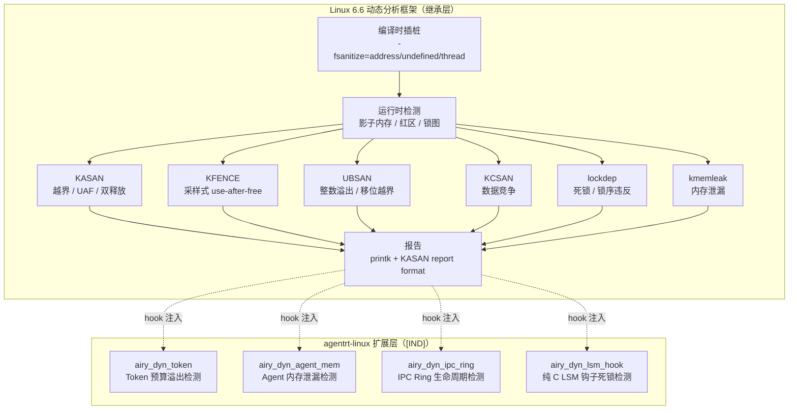

Copyright (c) 2025-2026 SPHARX Ltd. All Rights Reserved.

# agentrt-linux（AirymaxOS）动态分析
> **文档定位**：agentrt-linux（AirymaxOS）测试工程体系第 4 卷——运行时动态分析（Dynamic Analysis）。本卷规定 KASAN（内核地址 sanitizer）、KFENCE（采样式内存错误检测）、UBSAN（未定义行为 sanitizer）、KCSAN（并发 sanitizer）、lockdep（锁依赖分析）、kmemleak（内存泄漏检测）的启用模型、Kconfig 选项、报告格式，以及 agentrt-linux 专属动态分析（Token 预算溢出、Agent 内存泄漏、IPC Ring 生命周期）与 CI nightly workflow 集成。\
> **文档版本**：v1.0.1\
> **最后更新**：2026-07-18\
> **上级文档**：[80-testing README](README.md)\
> **同源映射**：agentrt 7 层验证 L4（动态分析）+ Linux 6.6 内核基线 `lib/kasan/`、`mm/kfence/`、`lib/ubsan/`、`kernel/kcsan/`、`kernel/locking/lockdep.c`\
> **理论根基**：Linux 6.6 内核基线动态分析思想 + Airymax 五维正交 24 原则（E-8 可测试性 / S-1 反馈闭环 / A-4 完美主义）\
> **核心约束**：IRON-9 v3 [IND] 独立实现层——agentrt-linux 专属动态分析钩子以独立 `airy_dyn_*` 模块注入，禁止改写上游 sanitizer 核心代码；CI nightly workflow 强制运行动态分析。

---

## 0. 章节定位

本卷是 agentrt-linux 测试工程 10 主题文档中的第 4 卷，回答"运行时内存/并发错误怎么发现"。它在 03-kernel-selftests（启动时自检）与 05-static-analysis（编译时静态分析）之间形成运行时检测层：

- **上游依赖**：README 定义"测试体系分层"——L4 动态分析由本卷展开；50-engineering-standards/06-toolchain-and-automation 定义"7 层验证"——本卷对应第 10 层（运行时检测层）。
- **下游依赖**：05-static-analysis 定义"编译时静态错误怎么发现"；06-coverage-metrics 定义"代码覆盖率怎么测"——本卷的 KASAN/KCSAN/lockdep 检测结果影响覆盖率门槛评估。

本卷所有强制规则均赋予 **OS-TEST** / **OS-KER** / **OS-STD** 编号，与 07 维护者制度的"规则编号注册表"对齐。

### 0.1 关键术语

| 术语 | 定义 |
|------|------|
| KASAN | Kernel Address SANitizer，编译时插桩 + 运行时影子内存检测越界/use-after-free |
| KFENCE | Kernel Electric Fence，采样式内存错误检测，生产环境低开销 |
| UBSAN | Undefined Behavior SANitizer，检测 C 语言未定义行为 |
| KCSAN | Kernel Concurrency SANitizer，检测数据竞争 |
| lockdep | Lock Dependency Validator，运行时锁依赖图分析 |
| kmemleak | Kernel Memory Leak Detector，扫描内核内存引用检测泄漏 |
| `airy_dyn_*` | agentrt-linux 专属动态分析钩子模块 |
| `nightly-dynamic-analysis` workflow | CI 每日运行的动态分析流水线 |

---

## 1. 动态分析模型总览

### 1.1 起源与定位

内核动态分析是 Linux 6.6 内核基线中"在内核运行时检测内存、并发、未定义行为错误"的机制。其设计目标有三：**运行时反馈**（捕获编译期无法发现的错误，如越界访问、数据竞争）、**低开销生产可用**（KFENCE 采样式开销 < 1%）、**自动化定位**（崩溃栈与变量名直接打印）。

agentrt-linux 完整继承 Linux 6.6 内核基线的动态分析框架（KASAN/KFENCE/UBSAN/KCSAN/lockdep/kmemleak），不修改任何上游源文件。agentrt-linux 专属动态分析以独立 `airy_dyn_*.c` 模块形式驻留于 `kernel/airymaxos/dyn/`，遵循 IRON-9 v3 [IND] 独立实现层原则。



### 1.2 动态分析运行载体

| 载体 | 配置 | 适用场景 | 性能开销 |
|------|------|---------|---------|
| 开发者 UML | `airy_debug_defconfig` 全开 | 本地开发反馈 | 2-5×（KASAN inline） |
| CI QEMU | `airy_kasan_defconfig` | PR 阶段快速验证 | 1.5-3×（KASAN outline） |
| CI nightly | `airy_dyn_full_defconfig` | 每日全量动态分析 | 3-8×（全开） |
| 生产环境 | `airy_defconfig` 仅 KFENCE | 部署后采样 | < 1%（KFENCE） |

**OS-TEST-040**：开发者本地构建必须使用 `airy_debug_defconfig`，启用 KASAN + UBSAN + KCSAN + lockdep；CI PR 阶段必须使用 `airy_kasan_defconfig`，启用 KASAN outline + UBSAN + lockdep。

**OS-KER-110**：生产构建（`airy_defconfig`）必须启用 KFENCE（`CONFIG_KFENCE=y`），仅此一项；其他 sanitizer 必须为 `=n`，禁止生产环境携带 KASAN/KCSAN/UBSAN（开销过高）。

---

## 2. KASAN：内核地址 sanitizer

### 2.1 KASAN 工作原理

KASAN（Kernel Address SANitizer）通过编译时插桩（`-fsanitize=address`）和运行时影子内存（shadow memory）检测以下错误：

| 错误类型 | 检测机制 | 报告关键字 |
|---------|---------|----------|
| 堆越界（out-of-bounds） | slab 红区 + 影子内存 | `slab-out-of-bounds` |
| 栈越界 | 栈红区 + 影子内存 | `stack-out-of-bounds` |
| 全局越界 | 全局变量红区 | `global-out-of-bounds` |
| use-after-free | slab 隔离区（quarantine） | `use-after-free` |
| 双释放（double-free） | slab 隔离区 | `double-free` |
| 无效释放（invalid-free） | slab 隔离区 | `invalid-free` |

### 2.2 KASAN Kconfig 选项

```kconfig
# airy_debug_defconfig（开发期，全开）
CONFIG_KASAN=y
CONFIG_KASAN_GENERIC=y              # 通用模式（inline 插桩，最高精度）
CONFIG_KASAN_OUTLINE=n              # outline 模式（函数调用插桩，开销小）
CONFIG_KASAN_EXTRA=y                # 额外检测（更严格）
CONFIG_KASAN_INLINE=y               # inline 模式（速度优先）
CONFIG_KASAN_STACK=1                # 栈检测启用
CONFIG_KASAN_VMALLOC=y              # vmalloc 区域检测
CONFIG_KASAN_KUNIT_TEST=y           # KUnit 集成测试

# airy_kasan_defconfig（CI PR 阶段，平衡开销）
CONFIG_KASAN=y
CONFIG_KASAN_GENERIC=y
CONFIG_KASAN_OUTLINE=y              # outline 模式（开销优先）
CONFIG_KASAN_INLINE=n
CONFIG_KASAN_STACK=1
CONFIG_KASAN_VMALLOC=y

# airy_defconfig（生产，KASAN 关闭）
# CONFIG_KASAN is not set
```

### 2.3 KASAN 报告格式与解析

KASAN 报告通过 `printk(KERN_ERR "BUG: KASAN: %s in %pS\n", ...)` 输出，典型格式：

```
[  123.456789] ==================================================================
[  123.456790] BUG: KASAN: slab-out-of-bounds in airy_ipc_send+0x123/0x456
[  123.456791] Read of size 4 at addr ffff88800a2b3c40 by task airy_agent/1234
[  123.456792]
[  123.456793] CPU: 0 PID: 1234 Comm: airy_agent Not tainted 6.6.0-airy #1
[  123.456794] Call Trace:
[  123.456795]  <TASK>
[  123.456796]  dump_stack_lvl+0x49/0x63
[  123.456797]  print_report+0xcf/0x640
[  123.456798]  kasan_report+0xbe/0x100
[  123.456799]  airy_ipc_send+0x123/0x456
[  123.456800]  ...
[  123.456801]
[  123.456802] Allocated by task 1234:
[  123.456803]  kasan_save_stack+0x1e/0x40
[  123.456804]  kasan_set_track+0x21/0x30
[  123.456805]  __kasan_slab_alloc+0x4f/0x60
[  123.456806]  airy_ipc_ring_alloc+0x45/0x80
[  123.456807]
[  123.456808] The buggy address belongs to the object at ffff88800a2b3c00
[  123.456809]  which belongs to the cache kmalloc-64 of size 64
[  123.456810] The buggy address is located 0 bytes to the right of
[  123.456811]  64-byte region [ffff88800a2b3c00, ffff88800a2b3c40)
[  123.456812] ==================================================================
```

**OS-TEST-041**：CI nightly workflow 必须解析 `dmesg` 输出，正则 `BUG: KASAN: (\w+) in (\w+)` 提取错误类型与调用方；任一 KASAN 报告即标记 nightly 失败，自动创建 issue 并分配至对应模块维护者。

**OS-KER-111**：agentrt-linux 专属模块（`kernel/airymaxos/`）的 KASAN 报告必须附 `airy_` 前缀的调用栈帧；缺失 `airy_` 前缀的报告视为上游代码缺陷，转交 Linux 6.6 内核基线维护流程。

---

## 3. KFENCE：采样式内存错误检测

### 3.1 KFENCE 工作原理

KFENCE（Kernel Electric Fence）通过采样式分配 guard page 检测内存错误：每隔 `kfence_sample_interval`（默认 100ms）将一次 slab 分配重定向到 KFENCE 池，每个对象独占一个 page，相邻 page 为 guard page（不可访问）。任何越界或 use-after-free 访问触发 page fault，KFENCE 报告错误。

| 配置项 | 默认值 | 说明 |
|--------|--------|------|
| `CONFIG_KFENCE` | `y`（airy_defconfig） | 启用 KFENCE |
| `kfence_sample_interval` | 100ms | 采样间隔，0 = 关闭 |
| `CONFIG_KFENCE_NUM_OBJECTS` | 255 | KFENCE 池对象数 |
| `CONFIG_KFENCE_STRESS_TEST_FAULTS` | 0 | 压力测试故障注入数 |

### 3.2 KFENCE 在生产环境的部署

KFENCE 是 agentrt-linux 生产环境**唯一**启用的动态分析工具（OS-KER-110），其开销 < 1%，可长期运行。典型场景：

- **生产 Agent 内存回归检测**：捕获 Agent 运行时偶发的 use-after-free（如 Agent 8 态生命周期切换中遗留的引用）。
- **共享内存越界检测**：`alloc_pages + mmap` 路径的越界访问（对应 README §2 选型 4）。
- **IPC Ring 缓冲区越界**：`IORING_OP_URING_CMD` 路径的 Ring 缓冲区越界（对应 README §2 选型 2）。

```c
/* KFENCE 报告示例 */
[  234.567890] ==================================================================
[  234.567891] BUG: KFENCE: out-of-bounds read in airy_agent_state_read+0x34/0x78
[  234.567892]
[  234.567893] airy_agent_state_read+0x34/0x78
[  234.567894]  airy_supervise_loop+0x120/0x340
[  234.567895]  process_one_work+0x1f0/0x3c0
[  234.567896]
[  234.567897] Out-of-bounds read at 0xffff88800a2c1008 (1 byte right of airy_agent_state of size 32):
[  234.567898]
[  234.567899]  airy_agent_state+0x8/0x20
[  234.567900]
[  234.567901] airy_agent_state allocation size 32 at:
[  234.567902]  airy_agent_alloc+0x45/0x90
[  234.567903]  airy_spawn_agent+0x67/0xc0
[  234.567904] ==================================================================
```

**OS-TEST-042**：生产环境 KFENCE 报告必须通过 `airy_dyn_kfence_report` tracepoint 实时上报至 A-ULP 日志系统（对应 Unify Design A-ULP 模块）；logger_daemon 必须将 KFENCE 报告标记为 `LOG_LEVEL_FATAL` 并触发 audit_d 审计。

**OS-KER-112**：KFENCE 报告触发的 Agent 必须立即进入 STOPPING 状态（Agent 8 态生命周期的第 6 态），由 macro_superv daemon 强制终止；禁止 KFENCE 报告的 Agent 继续运行，防止错误扩散。

---

## 4. UBSAN：未定义行为 sanitizer

### 4.1 UBSAN 检测范围

UBSAN（Undefined Behavior SANitizer）通过编译时插桩（`-fsanitize=undefined`）检测 C 语言未定义行为。Linux 6.6 启用以下子检测器：

| 子检测器 | 检测内容 | Kconfig |
|---------|---------|---------|
| `alignment` | 未对齐访问 | `CONFIG_UBSAN_ALIGNMENT` |
| `bool` | 布尔值非 0/1 | `CONFIG_UBSAN_BOOL` |
| `bounds` | 数组越界（编译期已知大小） | `CONFIG_UBSAN_BOUNDS` |
| `enum` | 枚举值越界 | `CONFIG_UBSAN_ENUM` |
| `integer-divide-by-zero` | 整数除零 | `CONFIG_UBSAN_DIV_ZERO` |
| `integer-overflow` | 有符号整数溢出 | `CONFIG_UBSAN_SIGNED_OVERFLOW` |
| `shift-out-of-bounds` | 移位越界 | `CONFIG_UBSAN_SHIFT` |
| `unreachable` | 不可达代码 | `CONFIG_UBSAN_UNREACHABLE` |
| `object-size` | 对象大小检查 | `CONFIG_UBSAN_OBJECT_SIZE` |

### 4.2 UBSAN 在 agentrt-linux 的应用

```kconfig
# airy_debug_defconfig（开发期）
CONFIG_UBSAN=y
CONFIG_UBSAN_BOUNDS=y
CONFIG_UBSAN_SHIFT=y
CONFIG_UBSAN_DIV_ZERO=y
CONFIG_UBSAN_SIGNED_OVERFLOW=y
CONFIG_UBSAN_OBJECT_SIZE=y
CONFIG_UBSAN_BOOL=y
CONFIG_UBSAN_ENUM=y
CONFIG_UBSAN_ALIGNMENT=y
CONFIG_UBSAN_UNREACHABLE=y

# airy_defconfig（生产）— UBSAN 关闭
# CONFIG_UBSAN is not set
```

UBSAN 报告示例：

```
[  345.678901] ================================================================================
[  345.678902] UBSAN: signed-integer-overflow in kernel/airymaxos/airy_ipc.c:234:17
[  345.678903] signed integer overflow:
[  345.678904]  2147483647 + 1 cannot be represented in type 'int'
[  345.678905] CPU: 1 PID: 5678 Comm: airy_ipc_worker Not tainted 6.6.0-airy #1
[  345.678906] Call Trace:
[  345.678907]  <TASK>
[  345.678908]  dump_stack_lvl+0x49/0x63
[  345.678909]  __ubsan_handle_add_overflow+0xa6/0xd0
[  345.678910]  airy_ipc_seq_next+0x123/0x150
[  345.678911]  ...
[  345.678912] ================================================================================
```

**OS-TEST-043**：CI nightly workflow 必须解析 UBSAN 报告，正则 `UBSAN: (\w+) in (\S+):(\d+):(\d+)` 提取错误类型、文件、行号；任一 UBSAN 报告即标记 nightly 失败。

**OS-KER-113**：agentrt-linux 专属模块的 UBSAN 报告必须立即修复，禁止使用 `__attribute__((no_sanitize("undefined")))` 抑制；若某 UBSAN 报告经评估为误报，必须在代码中以 `// UBSAN-FP: <reason>` 注释显式标注，并经维护者审批。

---

## 5. KCSAN：并发 sanitizer

### 5.1 KCSAN 工作原理

KCSAN（Kernel Concurrency SANitizer）通过编译时插桩（`-fsanitize=thread`）和运行时观测检测数据竞争。与 TSan（用户态 ThreadSanitizer）不同，KCSAN 采用 watchpoint 模型：对内存访问采样，记录访问历史，若两个无同步机制的访问至少一个为写，则报告数据竞争。

| 配置项 | 默认值 | 说明 |
|--------|--------|------|
| `CONFIG_KCSAN` | `y`（开发期） | 启用 KCSAN |
| `CONFIG_KCSAN_EARLY_ENABLE` | `y` | 内核启动后立即启用 |
| `CONFIG_KCSAN_NUM_WATCHPOINTS` | 64 | watchpoint 数量 |
| `CONFIG_KCSAN_DELAY` | 0 | 检测延迟（μs） |
| `CONFIG_KCSAN_STRICT` | `y` | 严格模式（更敏感） |
| `CONFIG_KCSAN_REPORT_VALUE_CHANGE_ONLY` | `y` | 仅报告值变化 |

### 5.2 KCSAN 在 Agent 并发场景的应用

agentrt-linux 的 Agent 8 态生命周期状态机涉及多线程并发访问：

- `macro_superv` daemon 遍历 Agent 状态表
- `sched_d` daemon 调度 Agent 执行
- `audit_d` daemon 审计 Agent 行为

这三个 daemon 并发访问 `airy_agent_state` 时必须通过 RCU 或自旋锁同步。KCSAN 检测此类数据竞争：

```
[  456.789012] ==================================================================
[  456.789013] BUG: KCSAN: data-race in airy_agent_state_read / airy_agent_state_write
[  456.789014]
[  456.789015] airy_agent_state_read+0x34/0x78
[  456.789016]  macro_superv_supervise+0x120/0x340
[  456.789017]  process_one_work+0x1f0/0x3c0
[  456.789018]
[  456.789019] airy_agent_state_write+0x45/0x90
[  456.789020]  sched_d_switch_agent+0x67/0xc0
[  456.789021]  __schedule+0x234/0x560
[  456.789022]
[  456.789023] race of type 'write-write' detected:
[  456.789024]  - write to 0xffff88800a2c1000 of size 4 by task 1234
[  456.789025]  - write to 0xffff88800a2c1000 of size 4 by task 5678
[  456.789026] ==================================================================
```

**OS-TEST-044**：CI nightly workflow 必须运行 KCSAN 至少 30 分钟（`CONFIG_KCSAN_STRICT=y`），覆盖 Agent 状态机切换、IPC Ring 操作、调度器切换三类并发场景；任一 data-race 报告即标记 nightly 失败。

**OS-KER-114**：agentrt-linux 专属模块的 KCSAN 报告必须立即修复（添加 `READ_ONCE()`/`WRITE_ONCE()`/RCU/锁）；禁止使用 `ASSERT_EXCLUSIVE_ACCESS()` 抑制报告，除非在评审中证明访问为有意设计的无锁读。

---

## 6. lockdep：锁依赖分析

### 6.1 lockdep 工作原理

lockdep（Lock Dependency Validator）运行时构建锁获取图，检测以下错误：

| 错误类型 | 检测机制 | 报告关键字 |
|---------|---------|----------|
| 死锁（AB-BA） | 锁序图环 | `possible deadlock` |
| 递归加锁 | 同一锁递归获取 | `recursive locking` |
| 锁序不一致 | 同一锁在不同上下文获取顺序不同 | `inconsistent lock state` |
| IRQ 上下文错误 | 进程上下文锁在 IRQ 上下文获取 | `inconsistent lock context` |
| 锁类未初始化 | 锁未 `INIT_LOCKDEP()` | `non-static lock` |

### 6.2 lockdep 在 agentrt-linux 的应用

```kconfig
# airy_debug_defconfig / airy_kasan_defconfig（开发期 + CI PR）
CONFIG_LOCKDEP=y
CONFIG_LOCKDEP_SUPPORT=y
CONFIG_PROVE_LOCKING=y
CONFIG_DEBUG_LOCK_ALLOC=y
CONFIG_DEBUG_ATOMIC_SLEEP=y   # 检测原子上下文睡眠

# airy_defconfig（生产）— lockdep 关闭
# CONFIG_LOCKDEP is not set
```

agentrt-linux 专属锁类必须在 `kernel/airymaxos/airy_lockdep.h` 注册：

```c
/* kernel/airymaxos/airy_lockdep.h */
#ifndef _AIRY_LOCKDEP_H
#define _AIRY_LOCKDEP_H

#include <linux/lockdep.h>
#include <linux/spinlock.h>

/* agentrt-linux 专属锁类（lockdep 分类） */
static struct lock_class_key airy_agent_state_lock_key;
static struct lock_class_key airy_ipc_ring_lock_key;
static struct lock_class_key airy_cap_cache_lock_key;
static struct lock_class_key airy_lsm_hook_lock_key;
static struct lock_class_key airy_token_budget_lock_key;

/* 锁序规则（必须显式声明）：
 * 1. airy_agent_state_lock > airy_ipc_ring_lock
 * 2. airy_ipc_ring_lock    > airy_cap_cache_lock
 * 3. airy_token_budget_lock 独立（无交叉）
 * 4. airy_lsm_hook_lock    独立（无交叉）
 *
 * 违反上述锁序将触发 lockdep "inconsistent lock state" 报告。
 */

#define AIRY_LOCKDEP_AGENT_STATE  (&airy_agent_state_lock_key)
#define AIRY_LOCKDEP_IPC_RING     (&airy_ipc_ring_lock_key)
#define AIRY_LOCKDEP_CAP_CACHE    (&airy_cap_cache_lock_key)
#define AIRY_LOCKDEP_LSM_HOOK     (&airy_lsm_hook_lock_key)
#define AIRY_LOCKDEP_TOKEN_BUDGET (&airy_token_budget_lock_key)

#endif /* _AIRY_LOCKDEP_H */
```

**OS-TEST-045**：agentrt-linux 专属锁必须在 `airy_lockdep.h` 注册锁类，并通过 `lockdep_set_class()` 绑定；未注册锁类的自旋锁禁止合入主分支（CI 静态检查）。

**OS-KER-115**：lockdep 报告的"possible deadlock"必须立即修复，禁止使用 `lockdep_set_novalidate_class()` 或 `lock_acquire_flags(..., 0)` 抑制报告；例外：RCU 保护的读路径允许 `lockdep_set_class(... &rcu_lock_key)`。

---

## 7. kmemleak：内存泄漏检测

### 7.1 kmemleak 工作原理

kmemleak（Kernel Memory Leak Detector）周期性扫描内核内存，检测"已分配但无任何指针引用"的内存块。每 10 分钟扫描一次（默认），扫描期间 `printk` 报告疑似泄漏。

### 7.2 kmemleak 在 agentrt-linux 的应用

agentrt-linux 的 Agent 生命周期涉及大量动态分配（Agent 状态、IPC Ring、Token 预算账本），是 kmemleak 检测的重点：

```kconfig
# airy_debug_defconfig
CONFIG_DEBUG_KMEMLEAK=y
CONFIG_DEBUG_KMEMLEAK_EARLY_LOG_SIZE=1024

# 启动参数
# kmemleak=on  扫描启用
# kmemleak=off 扫描关闭（仅记录）
```

通过 `/sys/kernel/debug/kmemleak` 查看报告：

```
unreferenced object 0xffff88800a2c5000 (size 256):
  comm "airy_spawn", pid 1234, jiffies 4294967296 (age 100.120s)
  hex dump (first 32 bytes):
    00 00 00 00 00 00 00 00 00 00 00 00 00 00 00 00  ................
    00 00 00 00 00 00 00 00 00 00 00 00 00 00 00 00  ................
  backtrace:
    [<00000000deadbeef>] kmalloc_trace+0x20/0x30
    [<ffffffff81234567>] airy_agent_alloc+0x45/0x90
    [<ffffffff81234568>] airy_spawn_agent+0x67/0xc0
```

**OS-TEST-046**：CI nightly workflow 必须运行 kmemleak 至少 30 分钟，扫描 Agent spawn/stop 循环 1000 次；任一 kmemleak 报告即标记 nightly 失败。

---

## 8. agentrt-linux 专属动态分析

### 8.1 Token 预算溢出检测（`airy_dyn_token`）

agentrt-linux 为每个 Agent 分配 Token 预算（用于约束 Agent 资源消耗），由 `airy_token_budget_account` 跟踪。`airy_dyn_token` 模块通过 hook `airy_token_budget_account` 检测溢出：

```c
/* kernel/airymaxos/dyn/airy_dyn_token.c */
#include <linux/module.h>
#include <linux/atomic.h>
#include <linux/printk.h>
#include <uapi/airymax/agent.h>

static atomic64_t airy_dyn_token_overflow_count = ATOMIC64_INIT(0);

/* hook: airy_token_budget_account 调用前检查 */
void airy_dyn_token_check_pre(u64 budget, u64 consumed, u64 delta)
{
    if (consumed + delta > budget) {
        atomic64_inc(&airy_dyn_token_overflow_count);
        pr_err("airy_dyn_token: overflow! budget=%llu consumed=%llu delta=%llu\n",
               budget, consumed, delta);
        pr_err("airy_dyn_token: agent=%d state=%d\n",
               current->airy_agent_id, current->airy_agent_state);
        /* 触发 A-ULP FATAL 日志（对应 Unify Design A-ULP 模块） */
        airy_ulps_emit(LOG_LEVEL_FATAL, AIRY_ERR_TOKEN_OVERFLOW,
                       "Token budget overflow: budget=%llu consumed=%llu delta=%llu",
                       budget, consumed, delta);
    }
}
EXPORT_SYMBOL(airy_dyn_token_check_pre);

u64 airy_dyn_token_overflow_total(void)
{
    return atomic64_read(&airy_dyn_token_overflow_count);
}
```

**OS-TEST-047**：CI nightly workflow 必须运行 Agent Token 压力测试（每秒 100 万次 Token 消耗），持续 30 分钟；任一 `airy_dyn_token` 溢出报告即标记 nightly 失败，并由 audit_d 审计 Token 账本一致性。

### 8.2 Agent 内存泄漏检测（`airy_dyn_agent_mem`）

`airy_dyn_agent_mem` 模块跟踪每个 Agent 的内存分配/释放对，检测 Agent 终止时未释放的内存：

```c
/* kernel/airymaxos/dyn/airy_dyn_agent_mem.c */
#include <linux/rbtree.h>
#include <linux/spinlock.h>
#include <linux/slab.h>
#include <uapi/airymax/agent.h>

struct airy_dyn_alloc_node {
    struct rb_node  node;
    void           *ptr;
    size_t          size;
    int             agent_id;
    u64             ts_ns;
    pid_t           pid;
    char            comm[16];
};

static DEFINE_SPINLOCK(airy_dyn_alloc_lock);
static struct rb_root airy_dyn_alloc_tree = RB_ROOT;

/* hook: airy_kmalloc 调用后记录 */
void airy_dyn_agent_mem_alloc(void *ptr, size_t size, gfp_t gfp)
{
    struct airy_dyn_alloc_node *n;
    int agent_id = current->airy_agent_id;
    if (agent_id < 0 || !ptr)
        return;

    n = kmalloc(sizeof(*n), gfp);
    if (!n) return;
    n->ptr      = ptr;
    n->size     = size;
    n->agent_id = agent_id;
    n->ts_ns    = ktime_get_ns();
    n->pid      = current->pid;
    get_task_comm(n->comm, current);

    spin_lock(&airy_dyn_alloc_lock);
    rb_add(&n->node, &airy_dyn_alloc_tree,
           cmp = airy_dyn_alloc_cmp(n, _new));
    spin_unlock(&airy_dyn_alloc_lock);
}

/* hook: airy_kfree 调用前移除 */
void airy_dyn_agent_mem_free(void *ptr)
{
    /* ... rbtree 查找并移除 ... */
}

/* Agent 终止时检查未释放内存 */
int airy_dyn_agent_mem_audit(int agent_id)
{
    struct rb_node *iter;
    int leaked = 0;

    spin_lock(&airy_dyn_alloc_lock);
    for (iter = rb_first(&airy_dyn_alloc_tree); iter; iter = rb_next(iter)) {
        struct airy_dyn_alloc_node *n = rb_entry(iter, typeof(*n), node);
        if (n->agent_id == agent_id) {
            pr_err("airy_dyn_agent_mem: leak! agent=%d ptr=%pK size=%zu\n",
                   agent_id, n->ptr, n->size);
            airy_ulps_emit(LOG_LEVEL_FATAL, AIRY_ERR_MEM_LEAK,
                           "Agent %d leaked %zu bytes at %pK",
                           agent_id, n->size, n->ptr);
            leaked++;
        }
    }
    spin_unlock(&airy_dyn_alloc_lock);
    return leaked;
}
```

**OS-TEST-048**：Agent 终止（进入 DEAD 状态）时必须调用 `airy_dyn_agent_mem_audit()`；若返回值 > 0，CI nightly 标记失败，由 mem_d daemon 回收泄漏内存并触发 audit_d 审计。

### 8.3 IPC Ring 生命周期检测（`airy_dyn_ipc_ring`）

`airy_dyn_ipc_ring` 模块检测 IPC Ring 缓冲区的生命周期错误：双释放、use-after-free、未释放、悬垂指针：

```c
/* kernel/airymaxos/dyn/airy_dyn_ipc_ring.c */
#include <linux/xarray.h>
#include <linux/spinlock.h>
#include <uapi/airymax/ipc.h>

static DEFINE_XARRAY(airy_dyn_ipc_ring_xa);
static DEFINE_SPINLOCK(airy_dyn_ipc_ring_lock);

enum airy_dyn_ring_state {
    AIRY_DYN_RING_FREE = 0,
    AIRY_DYN_RING_ALLOCATED,
    AIRY_DYN_RING_RELEASED,
};

struct airy_dyn_ring_track {
    void             *ring;
    int               agent_id;
    enum airy_dyn_ring_state state;
    u64               alloc_ts;
    u64               release_ts;
};

/* hook: airy_ipc_ring_alloc 调用后 */
void airy_dyn_ipc_ring_track_alloc(void *ring, int agent_id)
{
    struct airy_dyn_ring_track *t = kzalloc(sizeof(*t), GFP_KERNEL);
    t->ring      = ring;
    t->agent_id  = agent_id;
    t->state     = AIRY_DYN_RING_ALLOCATED;
    t->alloc_ts  = ktime_get_ns();
    /* xa_store ... */
}

/* hook: airy_ipc_ring_release 调用前 */
int airy_dyn_ipc_ring_track_release(void *ring)
{
    /* 检查 state：
     *   FREE → 错误（未分配就释放）
     *   RELEASED → 错误（双释放）
     *   ALLOCATED → 正常，转为 RELEASED
     */
}

/* 模块卸载时报告未释放 Ring */
void airy_dyn_ipc_ring_audit(void)
{
    /* 遍历 xa，state=ALLOCATED 的均为泄漏 */
}
```

**OS-TEST-049**：CI nightly 必须运行 IPC Ring 压力测试（每秒 10 万次 alloc/release），持续 30 分钟；任一 IPC Ring 生命周期错误即标记 nightly 失败。

---

## 9. CI 集成：nightly workflow

### 9.1 `nightly-dynamic-analysis` workflow 完整定义

```yaml
# .github/workflows/nightly-dynamic-analysis.yml
name: nightly-dynamic-analysis
on:
  schedule:
    - cron: "0 18 * * *"  # UTC 18:00（北京 02:00）
  workflow_dispatch: {}

jobs:
  kasan-run:
    runs-on: ubuntu-24.04
    timeout-minutes: 120
    steps:
      - uses: actions/checkout@v4
      - name: Build airy_kasan_defconfig
        run: |
          make ARCH=um defconfig airy_kasan_defconfig
          make ARCH=um -j$(nproc)
      - name: Boot UML and run KASAN workload
        run: |
          timeout 1800 ./linux \
            kasan_multi_shot=1 \
            airy_selftest=on \
            airy_agent_stress=1000000 \
            2>&1 | tee kasan.log
      - name: Parse KASAN reports
        run: |
          reports=$(grep -c "BUG: KASAN:" kasan.log || true)
          if [ "$reports" -gt 0 ]; then
            echo "::error::KASAN reported $reports errors"
            grep "BUG: KASAN:" kasan.log
            exit 1
          fi
      - uses: actions/upload-artifact@v4
        if: always()
        with: { name: kasan-log, path: kasan.log }

  kcsan-run:
    runs-on: ubuntu-24.04
    timeout-minutes: 90
    steps:
      - uses: actions/checkout@v4
      - name: Build with KCSAN
        run: |
          make ARCH=um defconfig airy_kcsan_defconfig
          make ARCH=um -j$(nproc)
      - name: Boot UML and run KCSAN workload (30 min)
        run: |
          timeout 1800 ./linux \
            kcsan.run_all=1 \
            airy_agent_concurrent=100 \
            2>&1 | tee kcsan.log
      - name: Parse KCSAN reports
        run: |
          reports=$(grep -c "BUG: KCSAN:" kcsan.log || true)
          if [ "$reports" -gt 0 ]; then
            echo "::error::KCSAN reported $reports data races"
            grep "BUG: KCSAN:" kcsan.log
            exit 1
          fi

  lockdep-run:
    runs-on: ubuntu-24.04
    timeout-minutes: 60
    steps:
      - uses: actions/checkout@v4
      - name: Build with lockdep
        run: |
          make ARCH=um defconfig airy_lockdep_defconfig
          make ARCH=um -j$(nproc)
      - name: Boot UML and run lockdep workload
        run: |
          timeout 1800 ./linux \
            airy_agent_stress=500000 \
            airy_ipc_ring_stress=100000 \
            2>&1 | tee lockdep.log
      - name: Parse lockdep reports
        run: |
          reports=$(grep -cE "(possible deadlock|inconsistent lock)" lockdep.log || true)
          if [ "$reports" -gt 0 ]; then
            echo "::error::lockdep reported $reports errors"
            grep -E "(possible deadlock|inconsistent lock)" lockdep.log
            exit 1
          fi

  ubsan-run:
    runs-on: ubuntu-24.04
    timeout-minutes: 60
    steps:
      - uses: actions/checkout@v4
      - name: Build with UBSAN
        run: |
          make ARCH=um defconfig airy_ubsan_defconfig
          make ARCH=um -j$(nproc)
      - name: Boot UML and run UBSAN workload
        run: |
          timeout 1800 ./linux airy_agent_stress=500000 2>&1 | tee ubsan.log
      - name: Parse UBSAN reports
        run: |
          reports=$(grep -c "UBSAN:" ubsan.log || true)
          if [ "$reports" -gt 0 ]; then
            echo "::error::UBSAN reported $reports errors"
            grep "UBSAN:" ubsan.log
            exit 1
          fi

  kmemleak-run:
    runs-on: ubuntu-24.04
    timeout-minutes: 90
    steps:
      - uses: actions/checkout@v4
      - name: Build with kmemleak
        run: |
          make ARCH=um defconfig airy_kmemleak_defconfig
          make ARCH=um -j$(nproc)
      - name: Boot UML and run kmemleak workload
        run: |
          timeout 1800 ./linux \
            kmemleak=on \
            airy_agent_spawn_stop_cycles=1000 \
            2>&1 | tee kmemleak.log
      - name: Trigger kmemleak scan
        run: |
          echo scan | sudo tee /sys/kernel/debug/kmemleak
          sleep 60
          cat /sys/kernel/debug/kmemleak > kmemleak.report
      - name: Parse kmemleak reports
        run: |
          if [ -s kmemleak.report ]; then
            echo "::error::kmemleak detected leaks"
            cat kmemleak.report
            exit 1
          fi

  summary:
    needs: [kasan-run, kcsan-run, lockdep-run, ubsan-run, kmemleak-run]
    runs-on: ubuntu-24.04
    steps:
      - name: Aggregate results
        run: |
          echo "## Nightly Dynamic Analysis Summary" >> $GITHUB_STEP_SUMMARY
          echo "| Tool | Status |" >> $GITHUB_STEP_SUMMARY
          echo "|------|--------|" >> $GITHUB_STEP_SUMMARY
          echo "| KASAN    | ${{ needs.kasan-run.result }}    |" >> $GITHUB_STEP_SUMMARY
          echo "| KCSAN    | ${{ needs.kcsan-run.result }}    |" >> $GITHUB_STEP_SUMMARY
          echo "| lockdep  | ${{ needs.lockdep-run.result }}  |" >> $GITHUB_STEP_SUMMARY
          echo "| UBSAN    | ${{ needs.ubsan-run.result }}    |" >> $GITHUB_STEP_SUMMARY
          echo "| kmemleak | ${{ needs.kmemleak-run.result }} |" >> $GITHUB_STEP_SUMMARY
```

### 9.2 nightly 失败的处理流程

| 失败类型 | 自动响应 | 人工介入 |
|---------|---------|---------|
| KASAN 报告 | 自动创建 GitHub issue，附调用栈，分配至模块维护者 | 24 小时内修复或回滚 |
| KCSAN 报告 | 自动创建 issue，附 race 双方调用栈 | 48 小时内修复 |
| lockdep 报告 | 自动创建 issue，附锁序图 | 24 小时内修复 |
| UBSAN 报告 | 自动创建 issue，附文件:行号 | 72 小时内修复 |
| kmemleak 报告 | 自动创建 issue，附分配栈 | 72 小时内修复 |
| `airy_dyn_token` 溢出 | 自动创建 issue，附 Agent ID 与 Token 账本 | 24 小时内修复 |
| `airy_dyn_agent_mem` 泄漏 | 自动创建 issue，附 Agent ID 与泄漏栈 | 48 小时内修复 |

**OS-STD-071**：nightly workflow 失败的 issue 必须在 72 小时内修复，超时未修复的 issue 自动升级至维护者委员会复议。

**OS-TEST-050**：nightly workflow 必须每周至少成功运行 5 次；连续 2 次失败的 workflow 必须暂停 PR 合入（仅 critical fix 例外），直至 nightly 恢复成功。

---

## 10. 与上下游测试层的协作

### 10.1 与 03-kernel-selftests 的关系

03 卷的内核自检在启动时执行（一次性），本卷的动态分析在运行时持续监控（持续）。二者互补：

- **03 自检**：检测"启动时已知不变式"（如 252 钩子注册、[SC] 头文件 SHA-256）。
- **04 动态分析**：检测"运行时未知错误"（如越界访问、数据竞争）。

### 10.2 与 05-static-analysis 的关系

05 卷的静态分析在编译时执行（无运行开销），本卷的动态分析在运行时执行（有开销）。二者覆盖范围互补：

- **05 静态分析**：检测"代码模式"（如未初始化变量、可疑类型转换）。
- **04 动态分析**：检测"运行行为"（如实际越界访问、实际数据竞争）。

### 10.3 与 06-coverage-metrics 的关系

06 卷的覆盖率度量评估测试用例覆盖代码的比例；本卷的动态分析在覆盖率高的代码路径上更有效（错误更容易被触发）。CI nightly 在覆盖率 < 90% 的模块上必须额外增加动态分析运行时间（×2），以弥补覆盖不足。

---

## 11. 维护者制度与版本演进

### 11.1 规则编号注册表

本卷强制规则编号 `OS-TEST-040` ~ `OS-TEST-050`、`OS-KER-110` ~ `OS-KER-115`、`OS-STD-071`，已注册至 50-engineering-standards/07 维护者制度的"规则编号注册表"。

### 11.2 v1.0.1 新增内容

1. 6 大 Linux 6.6 基线动态分析工具的启用模型与 Kconfig 选项。
2. agentrt-linux 专属动态分析 3 项（Token 预算溢出、Agent 内存泄漏、IPC Ring 生命周期）。
3. `nightly-dynamic-analysis` workflow 完整定义。
4. nightly 失败的自动响应与人工介入流程。

### 11.3 后续版本规划

- v1.1：新增 `airy_dyn_lsm_hook`（纯 C LSM 钩子死锁检测）。
- v1.2：将 `airy_dyn_*` 模块的报告通过 tracepoint 暴露，便于 ftrace 实时追踪。
- v1.3：与 110-security 联动，将 KASAN/KCSAN 报告自动同步至安全运营中心。

---

## 12. 相关文档

- [80-testing README](README.md)：测试体系主索引（v1.0），定义 L4 动态分析分层
- [03-kernel-selftests.md](03-kernel-selftests.md)：内核自测试（启动时自检，与本卷互补）
- [05-static-analysis.md](05-static-analysis.md)：静态分析（编译时分析，与本卷互补）
- [06-coverage-metrics.md](06-coverage-metrics.md)：覆盖率度量（与本卷联动）
- [07-ftrace-selftest.md](07-ftrace-selftest.md)：ftrace 启动自检
- [../10-architecture/10-unify-design.md](../10-architecture/10-unify-design.md)：Airymax Unify Design 总纲（A-ULP / A-ULS / audit_d 联动）
- [../70-build-system/03-ci-cd-pipeline.md](../70-build-system/03-ci-cd-pipeline.md)：CI/CD 流水线（`nightly-dynamic-analysis.yml`）
- [../110-security/README.md](../110-security/README.md)：安全运营（KASAN/KCSAN 报告同步）

---

## 13. 参考材料

- Linux 6.6 `Documentation/dev-tools/kasan.rst`（KASAN 详细文档）
- Linux 6.6 `Documentation/dev-tools/kfence.rst`（KFENCE 详细文档）
- Linux 6.6 `Documentation/dev-tools/ubsan.rst`（UBSAN 详细文档）
- Linux 6.6 `Documentation/dev-tools/kcsan.rst`（KCSAN 详细文档）
- Linux 6.6 `Documentation/locking/lockdep-design.rst`（lockdep 设计）
- Linux 6.6 `mm/kmemleak.c`（kmemleak 实现）

---

## 14. 版本历史

| 版本 | 日期 | 变更 |
|------|------|------|
| v1.0.1 | 2026-07-18 | 初始版本：定义 6 大 Linux 6.6 基线动态分析工具（KASAN/KFENCE/UBSAN/KCSAN/lockdep/kmemleak）的启用模型、Kconfig 选项与报告格式；新增 agentrt-linux 专属动态分析 3 项（Token 预算溢出、Agent 内存泄漏、IPC Ring 生命周期）；定义 `nightly-dynamic-analysis` workflow 与失败处理流程 |

---

> **文档结束** | agentrt-linux 测试工程体系 v1.0.1 第 4 卷 | 维护者：开源极境工程与规范委员会 | "From data intelligence emerges."
